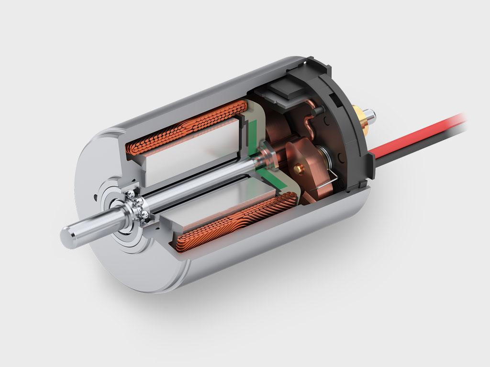

---
mathjax:
  presets: '\def\lr#1#2#3{\left#1#2\right#3}'
---

# Grotere vermogens aansturen  

---

Uitgangen van digitale IC’s of microcontrollers zijn beperkt in stroom die ze zowel kunnen sturen als opnemen. Bij een output wordt er gesproken over SOURCE CURRENT en SINK CURRENT. Current betekent stroom.  

* Als de stroom aan de uitgang wordt geleverd, en dus naar buiten vloeit, dan wordt deze stroom als SOURCE current benoemd (uitgang van de poort staat als logisch 1 = high geschakeld). Dit is een uitgang met een actief hoge uitgang.
* Als de stroom aan de uitgang IN de poort vloeit, dan staat deze stroom beschreven als SINK current (uitgang van de poort staat als logisch 0 = low geschakeld). Dit is een uitgang met een actief lage uitgang.

 en sinken (rechter afbeelding).")

Bij ICs en controllers (microprocessoren) is deze stroom per outputpin beperkt in waarde. Bijvoorbeeld bij een Arduino is deze stroom beperkt tot 40mA, bij de meeste microcontrollers zal dit ongeveer 20mA zijn. Bij IC’s wordt deze maximum toegelaten stroom in datasheets beschreven als IoLmax (voor sink) en IoHmax (voor source). Indien de stroom van een verbruiker groter is dan de stroom die maximaal kan worden geleverd, in source of in sink, door de output, dan kan gebruik gemaakt worden van een transistor om de stroom te versterken. Een andere reden tot gebruik van een transistor is dat de verbruiker op een hogere spanning werkt dan het IC, of controller. Voor de eenvoud wordt hier enkel de SOURCE werking behandeld met een NPN-transistor. Voor de SINK werking zou een PNP-transistor moeten worden gebruikt.

