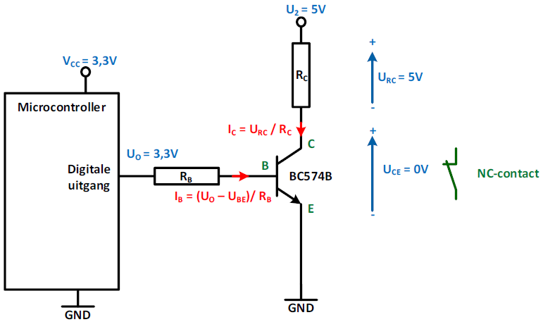
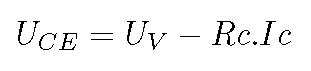
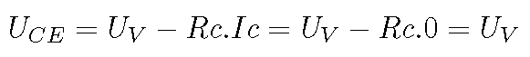

---
mathjax:
  presets: '\def\lr#1#2#3{\left#1#2\right#3}'
---

# Transistoren.

Als de maximale uitgangsstroom niet voldoende is om een verbruiker te laten werken (voorbeeld om een relais aan te sturen, of een andere verbruiker), dan wordt hier gebruik gemaakt van een transistor. De transistor bezit de functie om het vermogen te leveren aan de verbruiker wat de Output-pin van de microcontroller niet kan. Een andere reden waarom een transistor wordt gebruikt is dat de digitale uitgang van een microcontroller geen open-collector uitgang is, maar een actieve uitgangstrap. Zoals eerder vermeld kan bij dergelijke uitgangen geen andere voedingsbron worden gebruikt dan de VCC van het IC. En aangezien de meeste relais (of andere verbruikers) op een hogere spanning werken dan 5V, kan dit ook opgelost worden met een transistorschakeling.

Er zijn twee type transistoren: NPN en PNP. De symbolen van beide is terug te vinden in de figuur. Voor eenvoudige toepassingen zoals deze waarbij een relais moet worden aangestuurd vanuit een Output-pin van de microcontroller, volstaat een NPN transistor.  

De aansluitklemmen zijn:
**Basis**, **Emitter** en **Collector**.  

Let op de pijl op de emitter. De stroom kan enkel in die richting vloeien, vandaar dat een transistor enkel kan gebruikt worden in DC-toepassingen.

Er zijn twee stromen van toepassing bij de transistor. De basisstroom (*Ib*) en de collectorstroom (*Ic*). In de emitter vloeit de som van beide stromen.

De stroom versterkingsfactor *hFE* (beta) is de verhouding van de collectorstroom op de basisstroom. 

:::warning
Een transistor zal, indien mogelijk, er steeds voor zorgen dat de collectorstroom hFE keer groter is dan de basisstroom. 
:::

Een transistor bezit een vaste hFE. Dit kan met bepaalde meettoestellen worden bemeten. Binnen een bepaald type kan volgens de datasheet de hFE veel veranderen (grote spreiding) in waarde van transistor tot transistor.  

$$\h_{FE} = \frac{I_{C}} {I_{B}}$$

De basis-emitter spanning UBE is zoals een diode in doorlaat een spanning van 0,6V.

## Transistor als schakelaar  

Een transistor is een stroomversterker. Het component zal altijd, in de mate van het mogelijke, de basis-stroom versterken met een factor hFE. En deze te laten vloeien als de collector-stroom. 

* Indien de basis-stroom wordt overgedimentioneerd (een te grote stroom), komt het heel regelmatig voor dat de transistor in saturatie komt. Dit wil zeggen dat de verhouding niet meer opgaat, omdat een zo'n grote collector-stroom er niet kan vloeien (stroom wordt dan beperkt door andere elementen in de collector-kring). Op dat moment kan de transistor beschouwt worden als een gesloten schakelaar (tussen collector en emitter). De spanning tussen collector - emitter is dan gedaald tot bijna nul (UCE = 0V).

* Indien er echter totaal geen stroom vloeit in de basis, dan kan er ook geen stroom vloeien in de collector. In zo'n situatie kan de transistor vergeleken worden met een open schakelaar (tussen collector en emitter). De volledige bronspanning staat dan over de collector - emitter (Uce = Ubron).

Een transistor wordt in zo'n situaties veel toegepast. Er kan gesteld worden dat de transistor nu functioneert als een elektronische schakelaar. De bediening gebeurt echter niet manueel, maar door al dan niet een basis-stroom te sturen. Geen basis-stroom = open schakelaar (er kan geen IC vloeien), teveel basis-stroom = gesloten schakelaar (er kan een IC vloeien).

Een elektronische schakelaar (transistor, thyristor, mosfet, ...) bezit veel voordelen t.o.v. een klassieke mechanische schakelaar.  Als belangrijkste voordelen kan vernoemd worden:

*  veel kortere schakeltijden.
*  veel hogere schakelfrequenties.
*  compacter voor eenzelfde schakelvermogen.
*  bedrijfszekerder en duurzamer door het ontbreken van bewegende delen.

Een ideale elektronische schakelaar bezit onderstaande eigenschappen:

*  Raan = 0 ohm, in gesloten toestand is er bijgevolg geen spanningsverschil over de contacten. Saturatie van de transistor door grote Ib.
*  Ruit = oneindig ohm, in open toestand vloeit er geen stroom. De volledige bronspanning staat over de contacten. Cutt-Off van de transistor door Ib = 0.
*  schakelt zonder vertraging.
*  bezit een klein stuurvermogen.
*  is compact.
*  is betrouwbaar en duurzaam.

De collector-emittor overgang simuleert het schakelcontact van een gewone mechanische schakelaar.  UCE is de spanning over de contacten van de schakelaar. Zie formule. 

Zolang Ube kleiner is dan ongeveer 0,5 V wordt de transistor niet gestuurd en blijft hij bijgevolg gesperd. De basisstroom $ Ib $ is dan 0 en ook de collectorstroom $ Ic $ is 0. Zie formule \ref{eq:TR2}.

Door de schakelaar vloeit geen stroom en over zijn contacten staat de volle voedingsspanning.  Dit zijn de eigenschappen van een open schakelaar.

Als Ube groter wordt dan 0,6 V wordt de transistor gestuurd.  We zorgen ervoor dat hij volledig wordt uitgestuurd of gesatureerd is door Ib voldoende groot te kiezen.  In het ideale geval is UCE nu gelijk aan 0 V.  Over de contacten staat geen spanning en de stroom wordt enkel bepaald door de belastingsweerstand.  Dit zijn de eigenschappen van een gesloten schakelaar. Dit kan getekend worden in een XY-assenstelsel. (X = spanning over de transistor UCE, Y = collectorstroom Ic). Ideale schakelkarakteristiek van een bipolaire transistor. Zie figuur.

In punt A is: Ic = Uv/Rc en UCE =  0 V.  - Gesloten schakelaar - . Het opgenomen vermogen Pd = UCE. Ic = 0.Ic = 0 W .

In punt B is: UCE = Uv en Ic is 0A.  - Open schakelaar -. Het opgenomen vermogen Pd = UCE. Ic = Uv.0 = 0 W.

Het opgenomen vermogen in beide toestanden van de schakelaar is bijgevolg 0 W.  Tijdens het schakelen zelf neemt de transistor echter wel een zeker vermogen op omdat er bij de overgang van A naar B, of omgekeerd, wel stroom vloeit.

Als er rekening wordt gehouden met het niet-ideaal zijn van de transistor wil dit zeggen dat er in saturatie toch een kleine spanning over de collector-emitter staat en dus niet gelijk is aan 0V. Deze spanning is echter zeer klein en hangt af van type/soort transistor. Deze is weergegeven in de karakteristiek .

In punt A, bij gesloten schakelaar, is er wel een kleine spanning UCEsat over de transistor waardoor de collectorstroom kleiner is dan de waarde bepaald door de voedingsspanning en de collectorweerstand.
Bij bipolaire transistors houden we normaal rekening met een UCEsat van 0,3 V of lager; bij MOSFETS is deze spanning te verwaarlozen en rekenen we met 0 V.

In punt B, bij open schakelaar, vloeit er een kleine sperstroom I.  Het gevolg hiervan is dat de weerstand van de schakelaar geen oneindig is, maar een zekere waarde bezit.  Bij bipolaire transistors is de lekstroom in de orde van enkele µA, of nog kleiner, zodat de weerstand verschillende Mega ohm kan bedragen.  Bij MOSFETS is de lekstroom in de orde van nA zodat de weerstand kan oplopen tot miljoenen Mega ohm.

Er wordt hier eens een volledig ontwerp uitgewerkt waarbij de transistor werkt als elektronische schakelaar. Zie figuur .

We moeten een bepaalde waarde van collectorweerstand in serie met de led schakelen omdat de voedingsspanning te hoog is voor de led.  We moeten uiteraard de waarde van die weerstand kunnen berekenen.  Vervolgens moeten we de grootte van de basisweerstand berekenen die er zal voor zorgen dat de basisstroom en bijgevolg de collectorstroom voldoende groot is.

We kiezen voor een transistor van het type BC547.  In het vademecum vinden we voor UCEsat : 0,4 V en hFE = 200.  Bemerk dat we de minimale waarde van hFE kiezen zodat we zeker zijn dat de transistor in verzadiging komt.  Door de led wensen we een stroom van 10 mA en over de LED staat een spanning van 1,6 V.

De waarde van de collectorweerstand berekenen we uit :

  

De nodige basisstroom om deze collectorstroom te verkrijgen wordt gevonden met de formule \ref{eq:TR4}.

  

We kunnen nu tenslotte de grootte van de basisweerstand berekenen met de formule \ref{eq:TR5}.

  

Belangrijk is nog dat we bij het schakelen van een inductieve belasting, een relais bvb. (principewerking van een relais/contactor: zie figuur \ref{relais}), een diode moeten schakelen parallel over de belasting zoals getekend in figuur.

  

Uit de wet van Lenz weten we dat bij het uitschakelen een zeer hoge inductiespanning kan ontstaan, die op de collector van de transistor terecht komt.  Deze inductiespanning zal de transistor in de meeste gevallen vernietigen.  Zo een diode noemen we een vrijloopdiode.

  

Om het geheel nog duidelijker te maken en om een idee te hebben van de werkelijke waarden van de parameters berekenen we een volledige schakeling.  We werken met het basisschema van figuur met de LED.
De schakeling werkt op een voedingsspanning van 30 V en we wensen een collectorstroom van 150 mA.
Voor de parameters van de transistor kiezen we: Icsper = 0,1µA, hFEmin = 50, UBEsat =0,75 V en UCEsat =0,4 V.
We berekenen: Rc, Ib, Rb, Pdsat, Pdsper, Rcesat en Rcesper.

  

## Praktische relais sturing

Via een NPN-transistor wordt er een relais gestuurd die op zijn beurt een lamp op 230V laat branden.
Het schema is weergegeven in de volgende figuur.

 

De reden waarom er een relais gebruikt wordt is omdat microcontroller uitgangen alleen werken op een gelijkspanning. De ESP32 feather van Adafruit die wij gebruiken is bij hoog 3,3V.

Een relais met een stuurkring van gelijkspanning is heel gemakkelijk te vinden.

De meeste 'relais' hebben een vermogenkring die een 230V wisselspanning mogen schakelen. Tussen de microcontroller en het relais moet er een transistor worden voorzien omdat er geen relais bestaat met een stuurspanning van 3,3V en mochten die dan toch bestaan dan zou de stroom die zo een relais nodig zou hebben de 20mA van een uitgang van de microcontroller zeker overschrijden.

Het berekenen en bepalen van de schakeling start bij de lamp die geschakeld wordt. We gebruiken een standaard ledlamp op 230V met een vermogen van ongeveer een 10W. Uit deze gegevens kan gemakkelijk de stroom worden berekend dat de lamp uit het net zal trekken.

$$I = \frac{P} {U} = \frac{10W} {230V} = 43,478mA$$

Het relais dat we gebruiken is een relais van het merk Finder met referentie 55.34.9.024.0040 dat in volgende figuur is weergegeven. 

 

In de volgende figuur is de datasheet weergegeven.

 

Het relais moet in de vermogenkring een spanning kunnen schakelen van minimum 230V AC. Het gekozen relais kan spanningen tot 250V schakelen (2). De stroom die het relais moet voeren is 43,478mA. De stroom die het relais constant kan voeren is 7A (3). In het principeschema is er een smeltzekering geplaatst van 6A. In de praktijk zal er meestal een beveiligingsautomaat geplaatst worden. De waarde van 6A is in beide gevallen hetzelfde en met die reden omdat de stroom in de kring nooit groter mag worden dan 7A omdat het relais geen grotere stromen mag voeren.

De stuurspanning van het relais is 24VDC (4). Deze keuze is gemaakt omdat we een voeding van 24V DC hebben. Er zou gemakkelijk een ander relais gekozen kunnen worden met een lagere of hogere spanning.
Om de juiste transistor te kiezen moeten we weten hoeveel stroom het relais zal trekken in de stuurkring. In de datasheet zien we dat het relais op DC een vermogen trekt van 1W (5). Uit het vermogen kan de stroom worden berekend.

$$I = \frac{P} {U} = \frac{1W} {24V} = 𝟒𝟏,𝟔𝟔𝟕𝒎𝑨$$

Nu de werkspanning en de stroom van het relais is bepaald kan nu een keuze gemaakt worden voor de transistor. We hebben gekozen voor een BC574B omdat dit een veel gebruikte transistor is die niet duur is en voldoet aan de voorwaarden van onze schakeling. De belangrijkste gegevens van de datasheet zijn afgebeeld in Figuur 13.
Belangrijk is dat de collector-emitterspanning (=UCE) groter moet zijn dan de 24V DC-spanning. Deze spanning mag maximum 45V DC bedragen (1). De collectorstroom IC moet groter zijn dan de 41,667mA die het relais verbruikt. Deze mag maximum 100mA bedragen (2).

 

Het volgende dat berekend moet worden is de basisweerstand RB. De waarde moet zo gekozen worden dat de transistor in saturatie (=volledig geleiden) gaat als de uitgang van de microcontroller hoog is (=3,3V met de ESP32).

In de datasheet zien we dat de versterkingsfactor hFE ligt tussen de 110 en 800 (4). We zien in de datasheet dat de versterkingsfactor vergroot als de collectorstroom vergroot.

Voor onze berekening gebruiken we hier de typische versterkingsfactor van 150 (3). Dit is de waarde als IC 10μA is. Waarschijnlijk zal de versterkingsfactor in onze schakeling groter zijn omdat de collectorstroom IC groter is. Door 150 te gebruiken zal de transistor dan zeker in saturatie gaan.

Bij saturatie zien we dat de basis-emitterspanning (5) gelijk is aan 0,7V. Als we alle gegevens op het schema zetten dan bekomt men de afbeelding van de volgende figuur.

 

We nemen aan dat de collector-emitterspanning is saturatie gelijk is aan 0V. Praktisch zal dit ongeveer 0,2V zijn (zie datasheet 6). Dit wil zeggen dat de volledige voedingsspanning U2 (=24V) over de spoel van het relais staat waardoor deze zal aantrekken en de lamp in de vermogenkring zal doen branden. We weten dat de collectorstroom 41,667mA zal worden. Het eerste dat we berekenen is de basisstroom.

$$I_B = \frac{I_C} {h_{FE}} = \frac{𝟒𝟏,𝟔𝟔𝟕𝒎𝑨} {150} = 𝟐𝟕𝟕,𝟕𝟖μ𝑨$$

Het volgende dat we berekenen is de spanning over de basisweerstand. Dit kan berekend worden met de spanningswet van Kirchhoff (serieschakeling).

$$U_{ON} = U_{RB} + U_{BE}$$

$$U_{RB} = U_{ON} - U_{BE} = 3,3V - 0,7V = 2,6V$$

Als we de twee berekende waarden op het schema plaatsen bekomen we het schema van volgende figuur.

Nu we de spanning over en de stroom door RB weten kan nu met de wet van Ohm de basisweerstand RB worden berekend.

$$R_{B} = \frac{U_{RB}} {I_{RB}} = \frac{2,6V} {𝟐𝟕𝟕,𝟕𝟖μ𝑨} = 9,35k\Omega$$

De waarden van de E12-reeks hoger dan de berekende waarde is 10kΩ en de waarde lager is 8,2kΩ. Alhoewel 10kΩ dichter bij de berekende waarde ligt nemen we hier de kleinere waarde van 8,2kΩ zodat de transistor zeker in saturatie zal komen.
Het vermogen dat de weerstand ongeveer zal dissiperen kunnen we berekenen.

$$P_{RB} = U_{RB} . I_{RB} = 2,6V . 𝟐𝟕𝟕, 𝟕𝟖μ𝑨 = 𝟕𝟐𝟐, 𝟐𝟐𝟖μ𝑾$$

Een weerstand met een vermogen van 1/8W is zeker voldoende.

Het uiteindelijk schema is afgebeeld in de volgende figuur.

Als de uitgang van de microcontroller logisch laag gemaakt wordt bekomen we het schema met de spanningen en stromen afgebeeld in de volgende figuur. Dit is het schema van de transistor in cut-off.

Als de uitgang van de controller laag gemaakt wordt, dan is de spanning op de uitgangspin 0V. Dit wil zeggen dat de basis-emmitorspanning lager is dan de 0,6V en dat de stroom door de basis IB gelijk is aan 0A. IC is dan 0A (=IB.hFE = 0A . 150). De transistor zal niet geleiden en gedraagt zich als een open contact. Tussen de collector en de emitter staat de volledige voedingsspanning van 24V.
Over de spoel van het relais staat er geen spanning waardoor deze niet wordt aangetrokken.
De lamp zal niet branden.

## Praktisch: ESP32

Stel dat een verbruiker (werkspanning = 5V) moet worden aangestuurd vanuit een digitale outputpin van de ESP32. 
Er kunnen zich twee toestanden voordoen: 
>- Outputpin is laag (0V) => transistor in cut-off toestand (vgl. met open schakelaar)
>- Outputpin is hoog (3,3V) => transistor in saturatie toestand (vgl. met gesloten schakelaar)

Dit is weergegeven in volgende figuren:

 
 

Een transistor wordt in saturatie en cut-off veel toegepast. Men noemt dit de transistor als schakelaar en functioneert als een elektronische schakelaar. De bediening gebeurt echter niet manueel, maar door al dan niet een basis-stroom te sturen.
* Geen basis-stroom = open schakelaar (er kan geen IC vloeien) -> Cut-off;
* Te veel basis-stroom = gesloten schakelaar (IC die vloeit is maximum) -> Saturatie.

De collector-emittor overgang simuleert het schakelcontact van een gewone mechanische
schakelaar.

 

## Opdracht

Opdracht: Transistor als schakelaar.
<ul style="color: white;">
<li>Bouw de schakeling.</li>
<li>Schrijf een programma voor de microcontroller dat de lamp in een lus 3 seconden laat branden en nadien 3 seconden dooft. Herhaal het programma in een oneindige lus.</li>
<li>Toon de werking aan de docent.</li>
</ul>

