# Driver met meerdere transistoren

## Darlington Driver (ULN....)

Wanneer er nood is aan een reeks transistoren om bijvoorbeeld acht vermogenuitgangen te sturen kan men gebruik maken van een driver-IC. In deze behuizing zitten dan bijvoorbeeld acht vermogentrappen om van gewone digitale uitgangen vermogensturingen te maken. Ook hier is het zo dat de voedingsspanning zelf kan worden bepaald en dit hoeft geen beperking te zijn tot de voedingsspanning van de microcontroller zelf.

Een veel gebruikte reeks van driver-IC's zijn de ULN-reeksen, gemaakt door verschillende fabrikanten. Een voorbeeld is de ULN2803 met acht darlingtontransistor uitgangstrappen. Een darlingtontransistor of kort darlington is een schakeling van twee in cascade gekoppelde transistoren zoals in volgende figuur waar het symbool is afgebeeld.

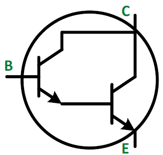

De stroomversterkingsfactor hFE van een darlingtontransistor is bij benadering het product van de stroomversterkingsfactoren van de twee afzonderlijke transistoren, zodat een darlington een zeer grote stroomversterkingsfactor heeft.

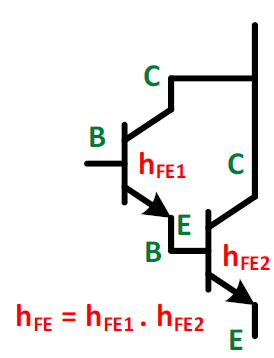

Soms is het nodig om met een kleine stroom (uitgangspoort van een microcontroller) een veel grotere stroom te sturen. Laagvermogentransistoren hebben een grote versterkingsfactor, maar kunnen geen grote stroom sturen. Hoogvermogentransistoren hebben doorgaans een lage stroomversterkingsfactor, en kunnen daarom met een niet al te kleine stroom aangestuurd worden. Door twee zulke transistoren in één schakeling te gebruiken, kunnen beide kenmerken samengevoegd worden en daarmee de goede eigenschappen kunnen worden gecombineerd.

Een dergelijk IC kan, afhankelijk van het type tot 50 V aan de uitgang schakelen en per kanaal (soms acht kanalen in één IC) een stroom schakelen tot 500mA. Het principeschema van het IC is afgebeeld in de volgende figuur.

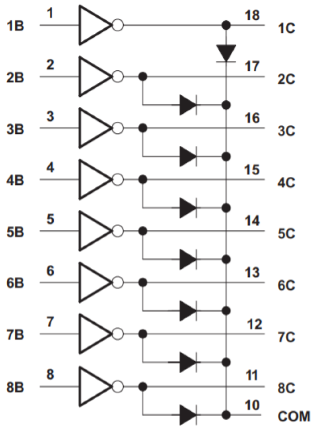

De dioden in het schema zijn nuttig wanneer inductieve belastingen worden geschakeld. De oplopende EMKz-spanning van die belasting wordt aan de hand van deze beveiligingsdioden kortgesloten. Een detail van een poort is terug te vinden in de volgende figuur. In het schema is duidelijk te zien dat de uitgang enkel een SINK-stroom kan voeren (=rode stroompijlen) en geen SOURCE-stroom.

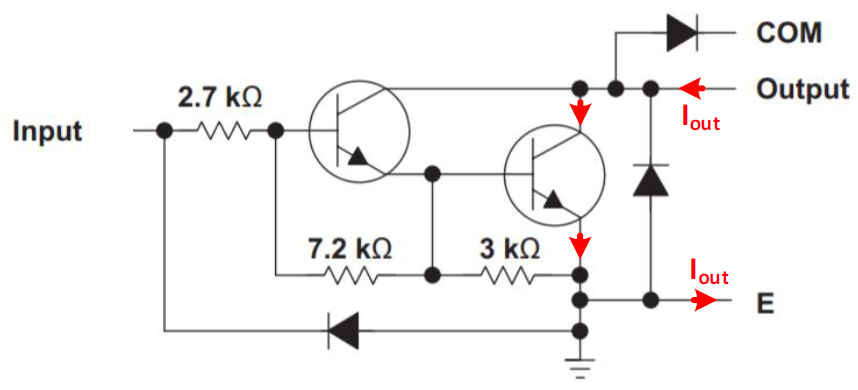

De aansluitingen en de pin-functies van het IC zijn weergegeven in de volgende figuur en tabel. Voor meer  informatie verwijzen we naar de datasheet.

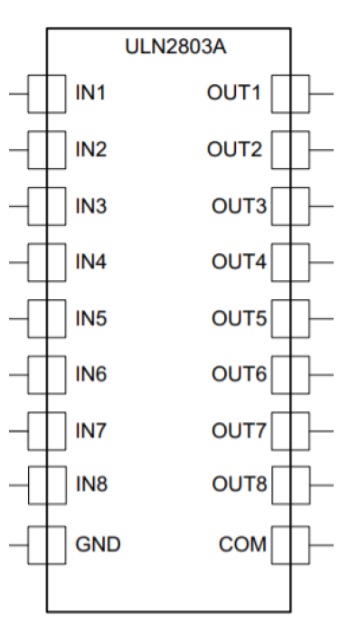

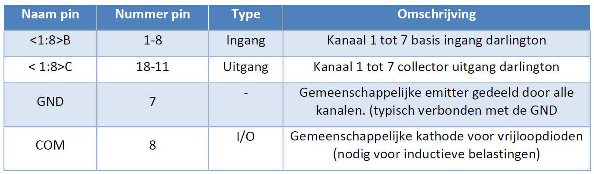

## Aansturen van een stappenmotor met een ULN2803A

### Principe en werking van een stappenmotor

Stappenmotoren zijn DC-motoren die kunnen ronddraaien in kleine stapjes zoals in de volgende figuur.

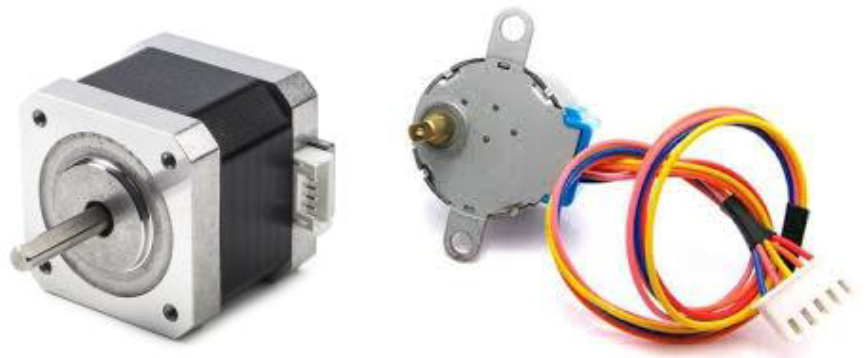

Ze worden veel gebruikt in allerlei toepassingen zoals in printers en 3D-printers om de printkop in de juiste positie te positioneren.

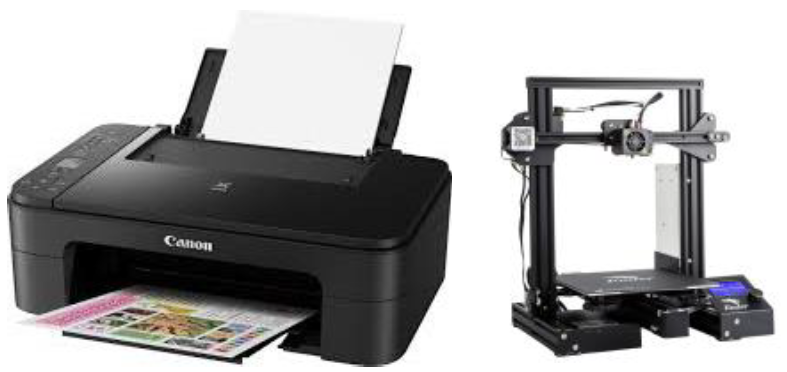

De stappenmotor is opgebouwd uit een rotor die ronddraait en een stator die vastzit aan de behuizing. De stator wordt hier bestuurd met 6 draden die uit de stappenmotor komen.

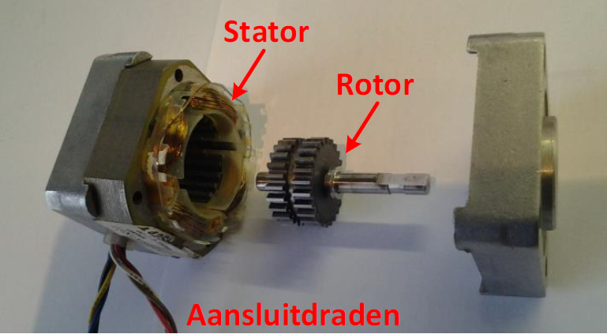

De rotor bestaat uit twee tandwielen die eigenlijk 1 grote permanente magneet vormen waarvan het éne tandwiel de noordpolen vormt en het andere tandwiel de zuidpolen. De tanden van de noordpolen vallen juist tussen de tanden van de zuidpolen (zie groene pijl).

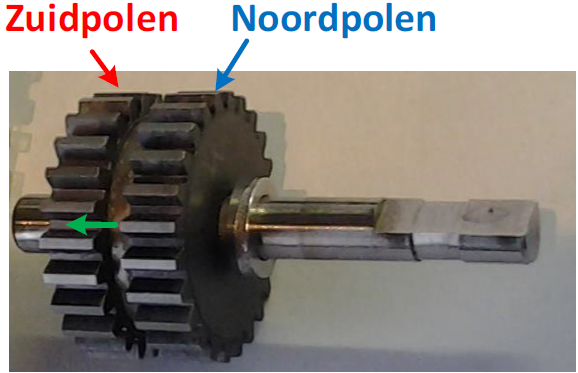

De stator is opgebouwd uit 4 spoelen met de naam A, A’, B en B’ zoals links afgebeeld in de volgende figuur. Afhankelijk van de zin van de stroom die door zo een spoel gestuurd wordt, wordt de getande metalen spoelkern gemagnetiseerd als noordpool of als zuidpool. In de rechtse afbeelding kan je zien dat er ook stappenmotoren bestaan uit 8 statorspoelen. De 8 spoelen staan dan per twee in serie om een beter magnetische koppeling met de rotor te bekomen. De aansturing is voor beide motoren hetzelfde.

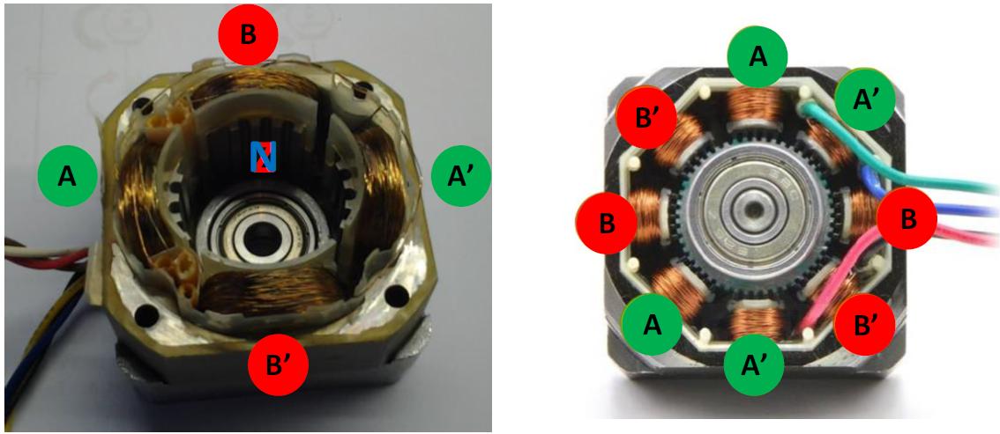

De meeste stappenmotoren die gebruikt worden zijn tweefasig en hebben een A en een B spoel. Om een nog grotere nauwkeurigheid te bekomen worden de fasen soms verhoogd. Er bestaan stappenmotoren met 3, 4 of soms wel 5 fasen zoals in de figuur. Door het verhogen van de fasen wordt de aansturing er niet eenvoudiger op.

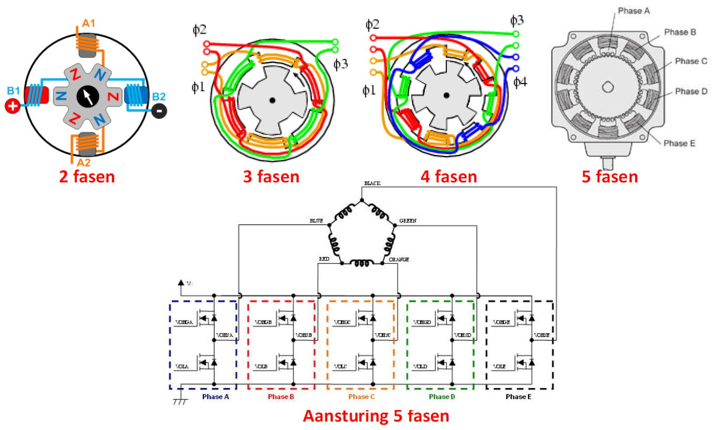

In de figuur herken je de 4 statorspoelen. De linkse afbeelding is vereenvoudig door het aantalr otorpolen naar 6 te herleiden. Deze bestaan uit 3 noord- en 3 zuidpolen. In het echt zullen het er meer zijn zoals in de rechtse figuur waar het aantal bestaat uit 24 noord- en 24 zuidpolen.

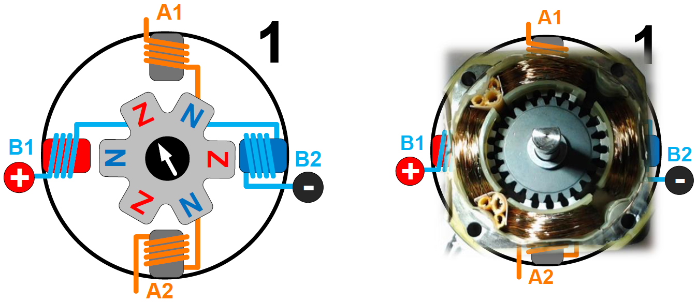

De stappenmotoren worden ingedeeld in twee grote groepen. De unipolaire en de bipolaire stappenmotoren. Bipolaire stappenmotoren kan je gemakkelijk herkennen omdat ze slechts 4 aansluitdraden hebben. Unipolaire stappenmotoren hebben meestal 6 maar soms ook 8 aansluitdraden.

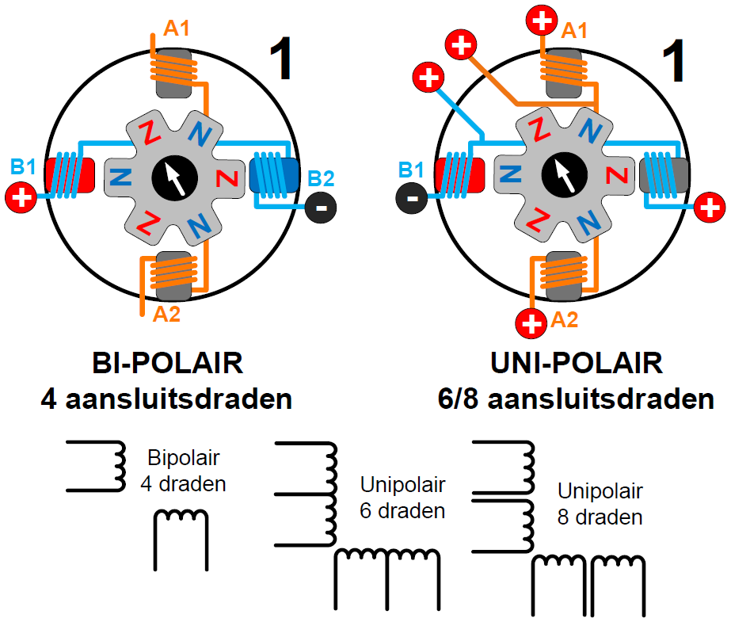

De stator van een stappenmotor bestaat uit 4 spoelen. Bij een bipolaire stappenmotor staan die spoelen per twee in serie. Bij unipolaire stappenmotoren is er een extra aftakking van de twee spoelen die naar buiten worden gebracht zodat er in totaal 6 draden zijn. Soms worden de draden van al de spoelen naar buiten gebracht en dan bekom je in totaal 8 aansluitdraden die je zelf nog moet verbinden.
Van een unipolaire stappenmotor kan je altijd een bipolaire stappenmotor maken door de midden aftakkingen van de twee spoelen niet te gebruiken. Bij een stappenmotor kan je gebruik maken van een H-brug zoals verder in het hoofdstuk gebruikt wordt bij het aansturen van een DC-motor.
Unipolaire stappenmotoren ga je aansturen met MOSFETs die beveiligd zijn met vrijloopdioden. Hiervoor kan je de ULN2803A gebruiken.

### Schema hardware

Via een microcontroler gaan we een stappenmotor aansturen. De stappenmotor die wij gaan gebruiken is een NEMA 17-formaat hybride stappenmotor die gebruikt kan worden als een unipolaire of bipolaire stappenmotor en heeft een staphoek van 1,8 ° (200 stappen per omwenteling). Elke fase trekt 1,2A bij 4V, waardoor een houdkoppel van 3,2 kg-cm (44 oz-in) mogelijk is.
Het is een stappenmotor met referentie SY42STH47-1206A van de firma Pololu waarvan de belangrijkste gegevens in zijn afgebeeld.

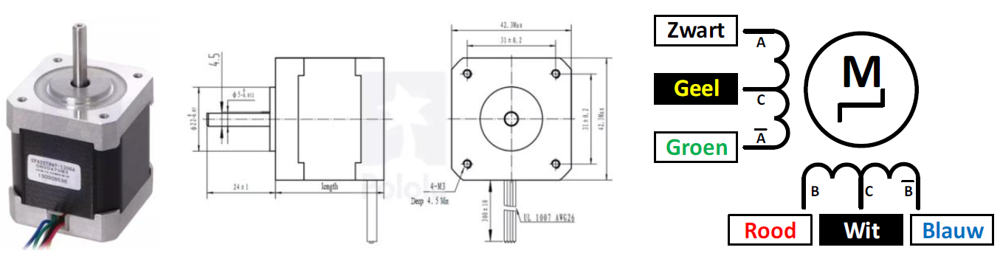

Het schema is weergeven in Figuur 32. Neem de ESP32 feather van Adafruit en plaats er de ESP32-shield op. De twee drukknoppen en de 4 leds van het schema staan op de ESP32-shield. De drukknoppen worden gebruikt om de draairichting in te stellen en om de motor wel of niet te laten draaien. De leds dienen als controle als de fasen juist aangestuurd worden.
De ULN2803 is een 8-voudige darlingtondriver die gebruikt wordt om de unipolaire stappenmotor aan te sturen. De microcontroller mag maximum 20mA sinken of sourcen en de stappenmotor laat een stroom per fase vloeien van 1,2A met een spanning van 4V, wat veel te hoog is om rechtstreeks aan te sluiten.
Om de stappenmotor te voeden gebruik je een labovoeding en deze stel je in op 4V.

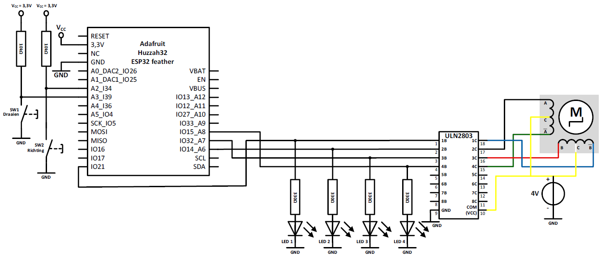

Hier volgt nog een schema voor een stappenmotor die een werkspanning bezit van 12V.

### Stappenmotor in Normale mode

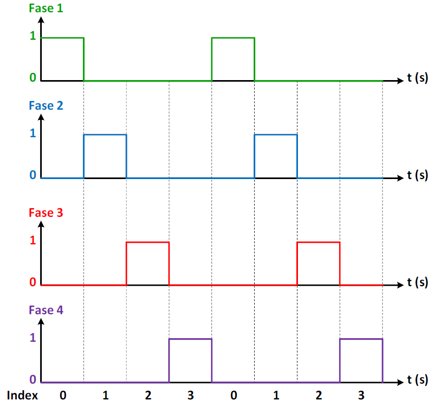

Eerst gaan we fase 1 hoog maken en al de andere fasen laag. Vervolgens wordt fase 2 hoog gemaakt en alle andere fasen laag. Zo gaan we een cyclus maken zodat ieder fase eens hoog wordt terwijl alle andere fasen laag zijn.
Iedere keer er een andere index wordt uitgevoerd zal de stappenmotor een klein stapje verdraaien.
Door de tijd van de index aan te passen zal de stappenmotor vlugger of trager draaien.
Door de indexen oplopend (= 1,2,3,4, …) uit te voeren zal de stappenmotor in wijzerszin draaien. Door de indexen aflopend (= 4,3,2,1, …) uit te voeren zal de stappenmotor in tegenwijzerszin draaien.
In de figuur is een samenvatting gemaakt van de 4 verschillende indexen.

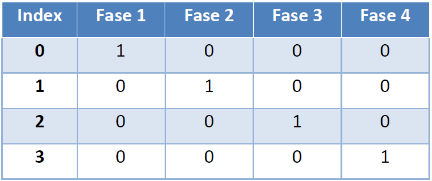

### Opdracht: Aansturen van een stappenmotor

Opdracht: Aansturen van een stappenmotor.
<ul style="color: white;">
<li>Bouw de schakeling met ULN2803 en stappenmotor.</li>
<li>Controleer de werkspanning van de stappenmotor en gebruikt een externe DC-bron.</li>
<li>Zorg voor volgende toestanden van de motor: Links draaiend, rechts draaiend en stoppen.</li>
<li>SW1: toggled tussen starten en stoppen van de motor.</li>
<li>SW2: toggled tussen links en rechts draaiend.</li>
<li>Met de potentiometer wordt de snelheid geregeld van de stappenmotor.</li>
<li>Toon de werking aan de docent.</li>
</ul>

### Stappenmotor in alternate mode (groter koppel)

Als we een groter koppel willen, dan gaan we de fasen wat overlappend aansturen zodat er op ieder moment twee fasen aangestuurd zijn. Dit noemen we de alternate mode waarvan het tijdvolgordediagram is weergegeven in de volgende figuur.

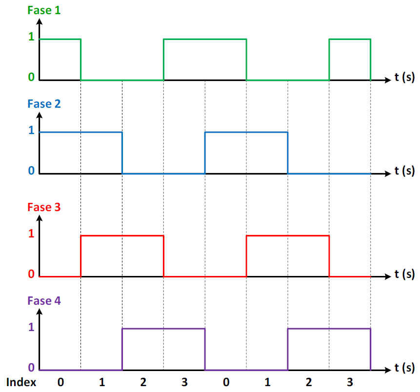

In de volgende figuur is een samenvatting gemaakt van de 4 verschillende indexen. De snelheid en de draairichting wijzigen is identiek als in de normale mode.

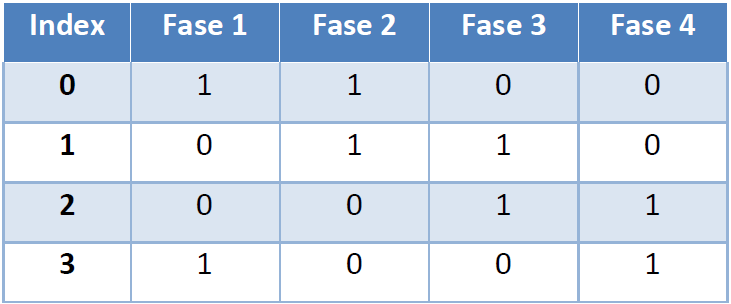

### Stappenmotor in advanced mode

Om de motor nog vloeiender te laten draaien is er de advanced mode. Een volledige cyclus bestaat uit 8 verschillende indexen in plaats van de 4 verschillende indexen zoals bij de normale en alternate mode.
Het tijdvolgordediagram is weergegeven in de volgende figuur.

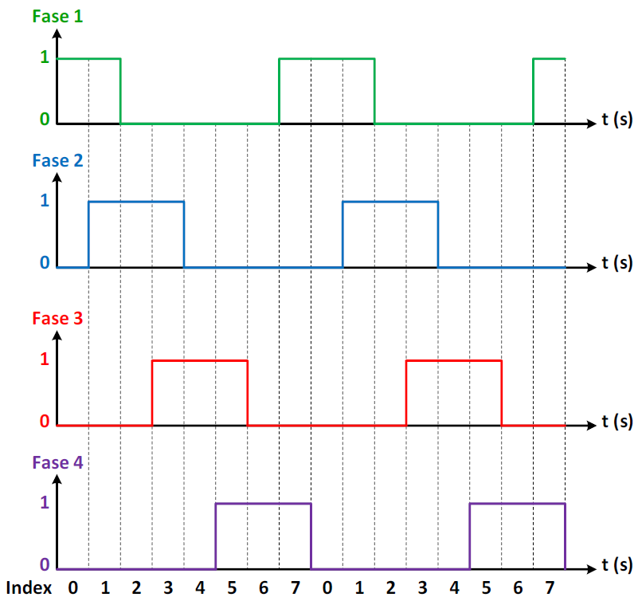

In de volgende figuur is een samenvatting gemaakt van de 4 verschillende indexen. De snelheid en de draairichting wijzigen is identiek als in de normale mode.

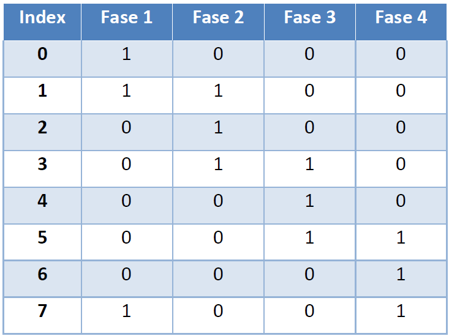