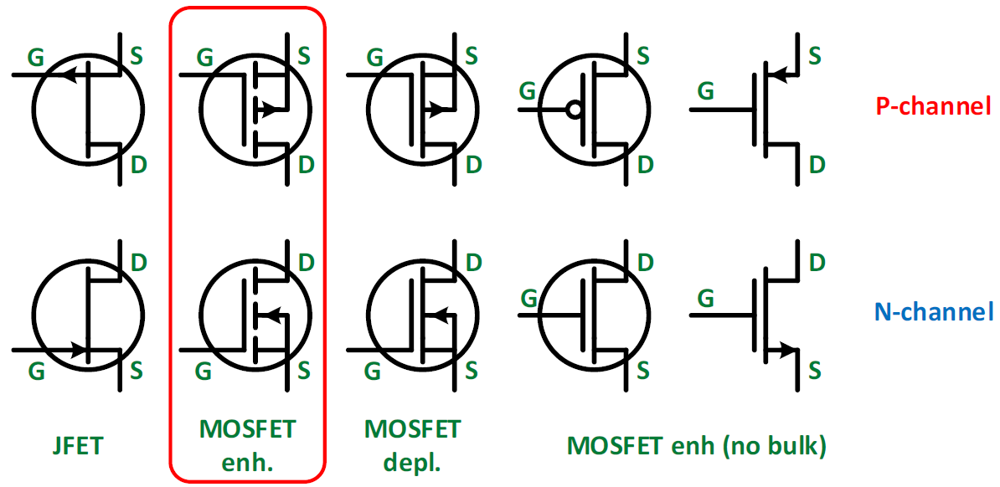
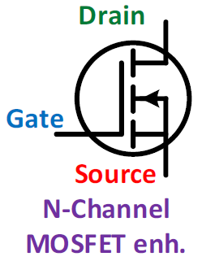
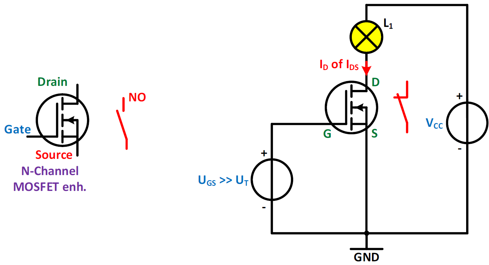
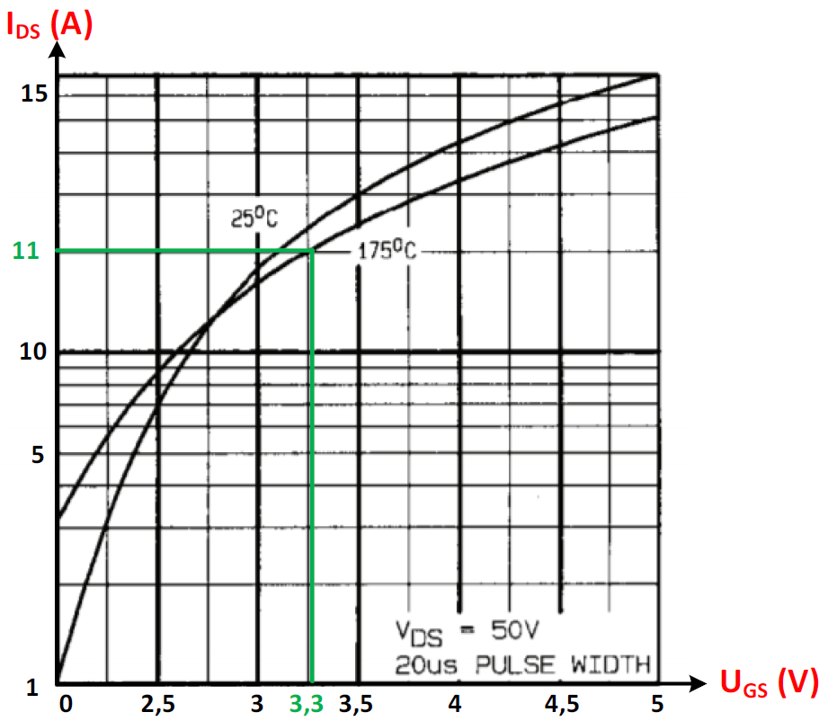
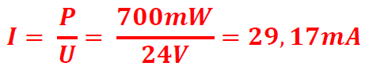
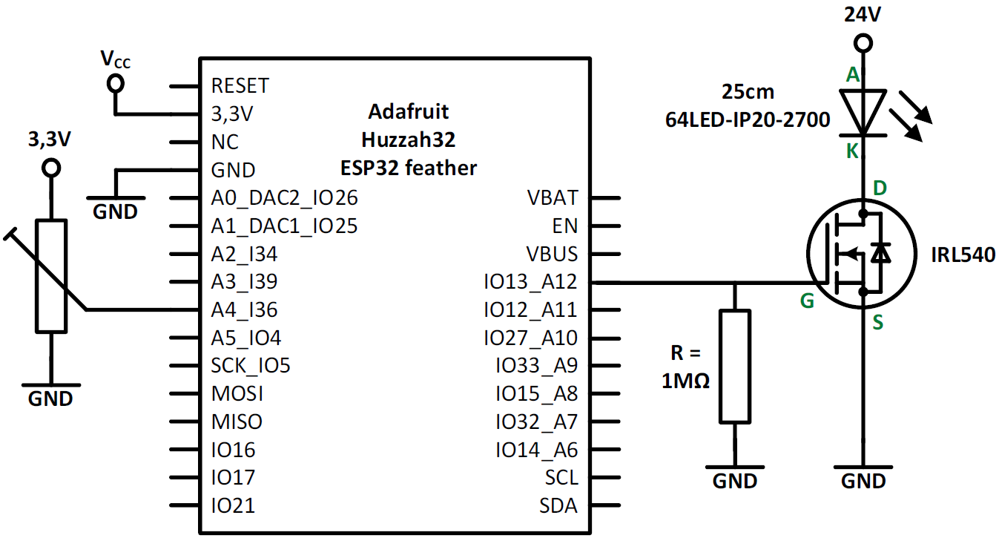

# MOSFET

Een MOSFET-transistor is sterk te vergelijken met een gewone transistor met het verschil dat de ´basis´ bij een MOSFET niet wordt gestuurd door een stroom maar door er een spanning op aan te sluiten.
Bij een MOSFET spreekt men bij de aansluitklemmen niet over basis, emitter en collector, maar over gate, source en drain.
De MOSFET kan ook gezien worden als een schakelaar waarbij het bedienen nu niet gebeurt met een stroom, maar door een spanning over de gate-source te plaatsen.
MOSFET is de afkorting van Metal Oxide Semiconductor Field Effect Transistor.
Net zoals bij de bipolaire transistor, waar deze familie wordt ingedeeld in NPN en PNP types, zijn er bij de FET-transistoren ook verschillende types te onderscheiden. In de volgende figuur is een overzicht gegeven van de verschillende soorten FET-transistoren.

We gaan niet alle FET’s bespreken. Specifiek wordt er ingezoomd op de N-kanaals MOSFET van het verrijkingstype (enhanced) zoals in volgende figuur.

## Werking van een IRL540 N-kanaals verrijkingsmosfet

We beschouwen de MOSFET als een spannings-gestuurde schakelaar met een NO-contact. Het maakcontact bevindt zich tussen de drain en source. We kunnen het contact sluiten door een voldoende hoge spanning aan te sluiten tussen de gate en de source. We noemen dit de stuurspanning UGS. In het vakjargon spreekt men over het kanaal in geleiding brengen. De streeplijn symboliseert het NO - contact van het kanaal.

Als UGS groter is dan de tresholdspanning VT, dan is De MOSFET in geleiding en zal IDS groter zijn dan 0A.
Fabrikanten van MOSFET ‘s geven in de datasheet (=data-blad) de waarde op van de treshold voltage VT. Wij gaan een IRL540 gebruiken waarbij VT ongeveer 2V is.
Wij vinden in het data-blad ook de transfertkarakteristiek. Een transfertkarakteristiek geeft het verband tussen de aangelegde stuurspanning UGS en de stroom IDS in het kanaal. Dit verband ligt vast en kunnen we niet wijzigen. De grafiek van een IRL540 is in de volgende figuur weergegeven en laat ons toe om de minimum benodigde stuurspanning UGS af te lezen om zeker een gesloten toestand van de halfgeleider te bekomen.

Wij gaan de MOSFET aansturen met de ESP32 waarbij de spanning op de uitgang bij een logisch 1 gelijk is aan 3,3V. Als we in de transfertkarakteristiek kijken dan is de maximale stroom door de MOSFET gelijk aan 11A zoals in het groen in de vorige figuur is weergegeven.

Wij gaan een ledstrip (64LED-IP20-2700 van Integratech) aansturen met een lengte van 25cm die een vermogen heeft van 2,8W per meter waarbij de werkspanning gelijk is aan 24V. De 24V spanning van de ledstrip is zeker niet te hoog want de IRL540 kan een spanning schakelen van 50V (=UDSmax). De te gebruiken ledstrip heeft een vermogen van ongeveer 700mW.

> -  25cm is gelijk aan 0,25m
> -  2,8W/m . 0,25m = 700mW

De stroom van de ledstrip is gelijk aan:

We zien dat de stroom kleiner is dan 11A wat wil zeggen dat de led op zijn volledige lichtsterkte zal branden als UGS gelijk is aan 3,3V.
Om zeker te zijn dat de ledstrip volledig zal branden is het aan te raden om eerst de stroom te meten door de ledstrip door deze rechtstreeks aan te sluiten op een 24V gelijkspanning vooraleer je deze gaat aansluiten via de MOSFET.
Wij willen de ledstrip dimmen en daarom gaan we gebruik maken van een PWM-uitgang.

## Schema van de MOSFET en de ledstrip

Bouw de schakeling zoals weergegeven in de volgende figuur.
Gebruik de potentiometer van de ESP-shield en vraag de nodige componenten aan de docent.
De weerstand R met een waarde van 1MΩ dient als beveiliging tegen statische elektriciteit.
Behandel de MOSFET met de nodige zorg en kom niet met je handen aan de aansluitingen.

## Opdracht: Leddimmer met een MOSFET

Opdracht: Leddimmer met een MOSFET.
<ul style="color: white;">
<li>Schrijf een programma waarmee je de lichtintensiteit kan regelen van een ledstrip door
gebruik te maken van een MOSFET die aangestuurd wordt met een PWM-signaal.</li>
<li>Gebruik voor de aansturing de ESP32-shield en regel de snelheid door gebruik te maken van
de potentiometer op de shield.</li>
<li>Laat het resultaat aan de docent zien.</li>

</ul>

