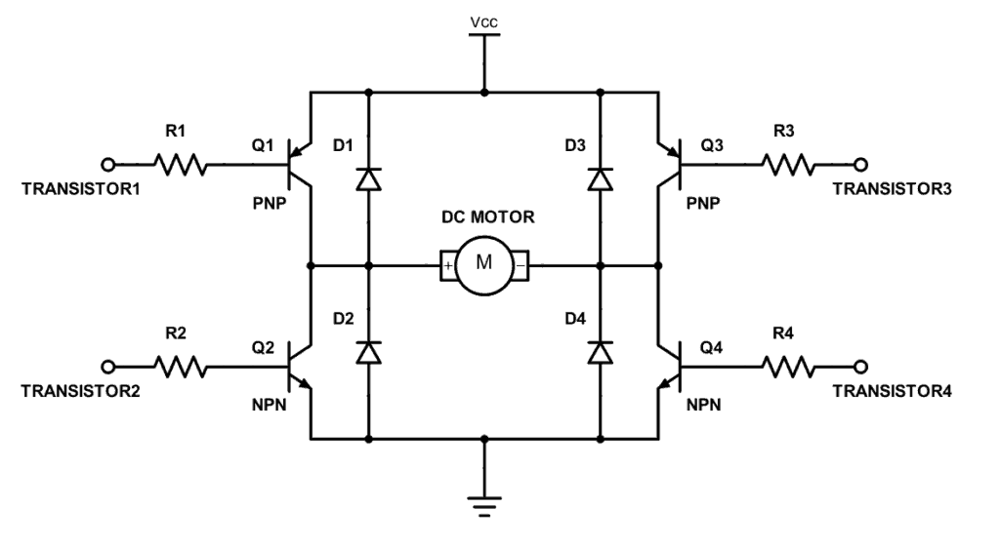
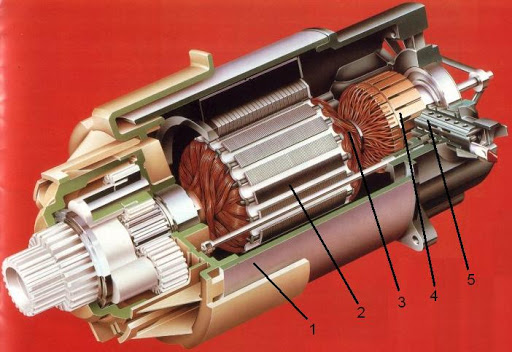
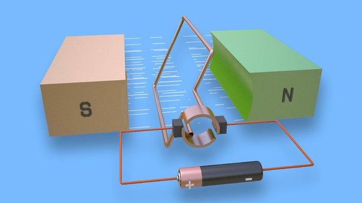
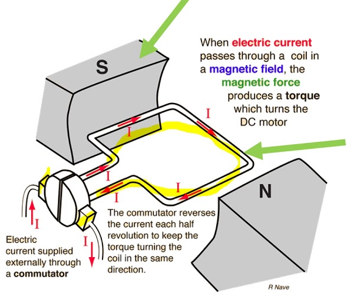
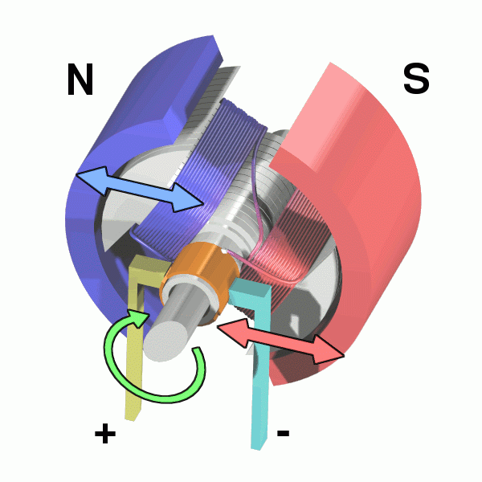
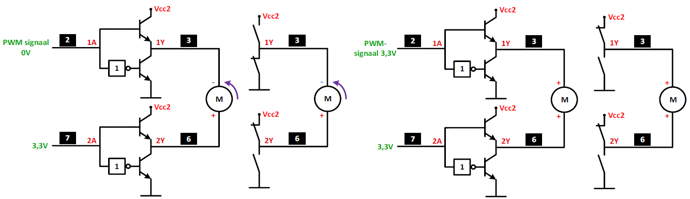
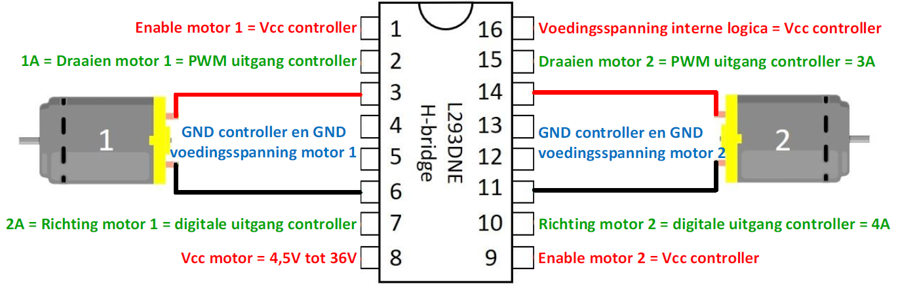
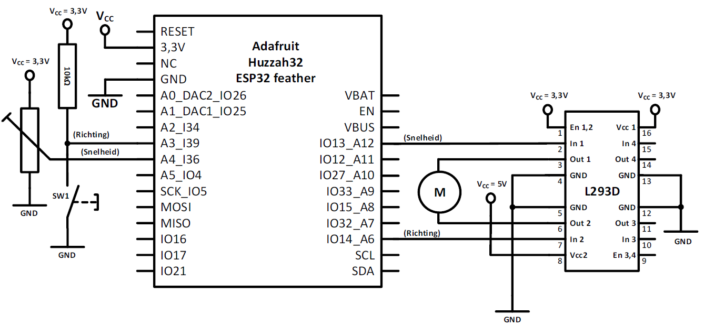

# H-brug

Microcontrollers worden ook wel gebruikt om motoren aan te sturen die op gelijkstroom werken.
Deze worden DC-motoren genoemd. Een goede manier om te weten hoe een DC-motor kan worden aangestuurd is kennis te hebben over de werking ervan dat behandeld is in het vak elektronica.
Een dergelijke motor kent eigenlijk twee parameters.
De eerste is de snelheid van de motor. De snelheid van een motor wordt uitgedrukt in toeren per minuut (rpm).
Een tweede parameter is de draaizin. Als er op de as van de motor wordt gekeken, dan kan de motor in "wijzerzin" draaien (met de wijzers van de klok mee, Clockwise, CW). Of de motor kan in tegenwijzerzin draaien (Counter Clockwise, CCW).

Vanuit de microcontroller moet dus zowel de snelheid worden geregeld als de draaizin.
De snelheid wordt met een PWM-signaal geregeld.

Een DC-motor bestaat uit een stator (stilstaand gedeelte van de motor, behuizing), en een rotor (ronddraaiend gedeelte, rotatieas met spoelen, ook wel anker genoemd).  

>- stator : bestaat uit mangneetpolen. Een magneet bestaat uit twee polen, een Noord- en een Zuid-pool. Beide polen worden tegenover elkaar geplaatst binnen de behuizing van de motor. Er is dus een mangnetisch veld in het midden van de motor.
>- rotor : in dit magnetisch veld worden elektrische geleiders voorzien op de rotor. De geleiders liggen in lussen. Indien door een lus een stroom wordt gestuurd, dan ontstaat er op de geleiders van die lus twee krachten (Lorentzkracht). Die twee krachten zijn tegengesteld aan elkaar en vormen een koppel aan krachten. Dit koppel zorgt voor een roterende beweging van de lus. Als dit koppelkrachten groot genoeg is, dan ontstaat een draaibeweging.
>- commutator : via sleepringen of koolborstels kan de elektrische spanning op het roterende anker met de lussen worden aangesloten.  

De draaizin kan worden omgekeerd door de twee aansluitdraden op de motor om te wisselen zoals in de volgende figuur is afgebeeld.

Door gebruik te maken van meerdere transistoren of MOSFETs, specifiek in een H-brug opstelling, is men in staat om de stroomzin door het anker van de DC-motor eenvoudig te wijzigen zodat de motor in beide richtingen kan draaien. Zo een H-brug met transistoren is afgebeeld in de volgende figuur.

## Principe en werking van een H-brug

De vier transistoren of MOSFET’s in een H-brug kunnen eenvoudig voorgesteld worden door vier contacten om de werking ervan te verduidelijken zoals afgebeeld in de volgende figuur.

Men noemt dit een H-brug door de hoofdletter H die je kan zien in de schakeling. De transistoren worden gebruikt als schakelaar en deze kunnen dus open of gesloten zijn.

Door enerzijds S1 en S4 te sluiten en S2 en S3 te openen zal de stroom van de aangesloten bron van links naar rechts door de motor vloeien.
De stroom vloeit nu van de positieve klem van de bron, door S1, door de motor, door S4 en zo naar de negatieve aansluiting van de voeding. De motor zal nu bijvoorbeeld in wijzerzin draaien zoals in de volgnde figuur.

Door S1 en S4 te openen en S2 en S3 te sluiten zal de stroom in de andere richting door de motor vloeien (= van rechts naar links).
De stroom vloeit nu van de positieve klem van de bron, door S3, door de motor, door S2 en zo naar de negatieve aansluiting van de voeding. De motor zal nu bijvoorbeeld in tegenwijzerzin draaien zoals in de volgende figuur.

H-bruggen bestaan er in verschillende groottes. De keuze van de H-brug wordt bepaald door de stroom die erdoor moet vloeien en door de spanning van de DC-motor.

## L293D motor driver

De L293D H-brug is in IC-vorm te verkrijgen. Met deze H-brug kunnen laagvermogen DC-motoren worden aangestuurd. Een afbeelding van de H-brug en de DC-motor die wij gaan aansturen wordt in de volgende figuur afgebeeld.

De driver kan gebruikt worden om motoren aan te sturen met een voedingsspanning van 4,5V tot 36V waarbij er een stroom mag vloeien van ongeveer 1A. Voor meer gegevens verwijzen we naar de datasheet van de 293D.
Links in de figuur is het principe van de 293D afgebeeld en rechts de pin-layout. In het IC zijn twee verschillende H-bruggen voorzien zodat deze gebuikt kan worden om een eenvoudige robot te bouwen.

Uit het principeschema en de pinaansluitingen kan het schema worden afgeleid om twee motoren aan te sturen en hiermee de draaizin te bepalen.
Als we het schema van de 293D intern vervolledigen met transistoren dan krijgen we volgend schema, waar eveneens de juiste signalen en de motoren zijn aangesloten.
Een logisch 0 is gelijk aan 0V en een logisch 1 is gelijk aan 3,3V, omdat we een controller gebruiken met een voedingsspanning (=Vcc1) gelijk aan 3,3V.

Sluiten we aan stuuringang 1A een 3,3V spanning aan en aan ingang 2A een spanning van 0V, dan zal de motor in wijzerszin draaien zoals voorgesteld in de volgende figuur.

Sluiten we aan stuuringang 1A een spanning van 0V aan en aan ingang 2A een 3,3V spanning, dan zal de motor in tegenwijzerszin draaien zoals voorgesteld in de volgende figuur.

Sluiten we aan ingang 1A een PWM-signaal aan dan kunnen we de snelheid regelen.
Met de ingang 2A bepalen we de draairichting van de motor.
In de volgende figuur laten we de motor in wijzerszin draaien en laten we de snelheid regelen.
We laten de motor in wijzerszin draaien door de ingang 2A laag (=GND=0V) te maken.
Als het PWM-signaal hoog is dan zien we in de linkse figuur dat de motor in wijzerszin draait.
Als het PWM-signaal laag is dan zien we in de rechtse figuur dat de motor niet zal draaien omdat op beide klemmen dezelfde spanning is aangesloten, namelijk 0V (=GND).
Hoe hoger de duty-cycle, hoe meer het signaal op ingang 1A hoog zal zijn en hoe sneller de motor zal draaien.

In de volgende figuur laten we de motor in tegenwijzerszin draaien en laten we de snelheid regelen.
We laten de motor in tegenwijzerszin draaien door de ingang 2A hoog (=Vcc1=3,3V) te maken.
Als het PWM-signaal laag is dan zien we aan de linkse figuur dat de motor in tegenwijzerszin draait.
Als het PWM-signaal hoog is dan zien we aan de rechtse figuur dat de motor niet zal draaien omdat op beide klemmen dezelfde spanning is aangesloten, namelijk de voedingsspanning van de motor.
Hoe hoger de duty-cycle, hoe minder het signaal op ingang 1A hoog zal zijn en hoe trager de motor zal draaien. De duty-cycle is dan omgekeerd evenredig met de snelheid waarmee we rekening moeten houden in de software.

Om de draaizin en de snelheid te bepalen zijn hiervoor twee output pinnen per motor nodig van de microcontroller, bijvoorbeeld pin 2 en 7.
De draaizin van de motoren wordt bepaald met een digitale uitgang die we aan 2A en 4A aansluiten.
De snelheid van de motoren wordt bepaald met een PWM-uitgang die we aan 1A en 3A aansluiten.

## Draairichting en snelheid regelen van een DC-motor met een microcontroller.

We gaan de richting en de snelheid regelen van een DC-motor door gebruik te maken van een L293D driver, een ESP32 feather va Adafruit en een ESP32-shield.
Met de trimmer gaan we de snelheid regelen en met de drukknop SW1 de draairichting.

## Opdracht: Aansturen DC motor

Opdracht: Aansturen van een DCmotor die regelbaar is in snelheid en in draairichting.
<ul style="color: white;">
<li>Schrijf een programma waarmee je een DC-motor kan regelen in snelheid door
gebruik te maken van een L293D die aangestuurd wordt met een PWM-signaal.</li>
<li>Met een drukknop kan de draairichting geregeld worden.</li>
<li>Laat het resultaat aan de docent zien.</li>

</ul>

