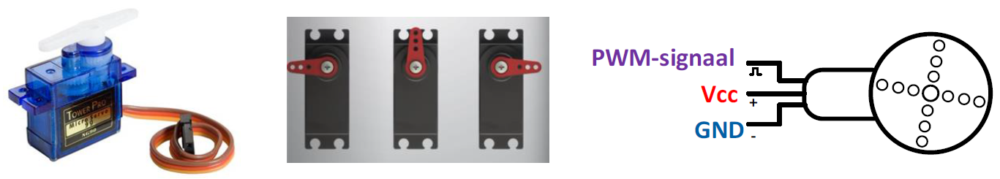
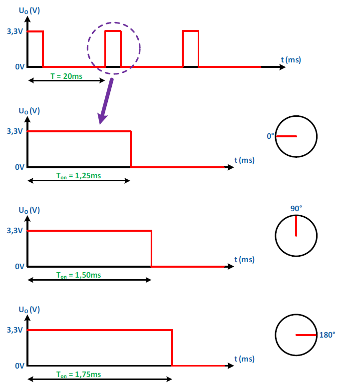
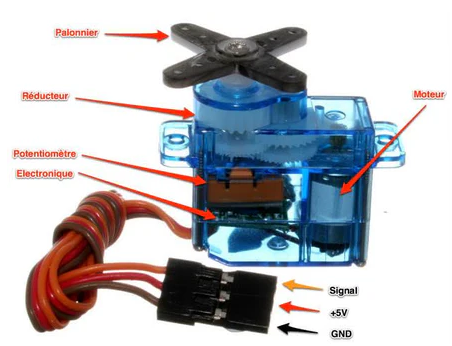
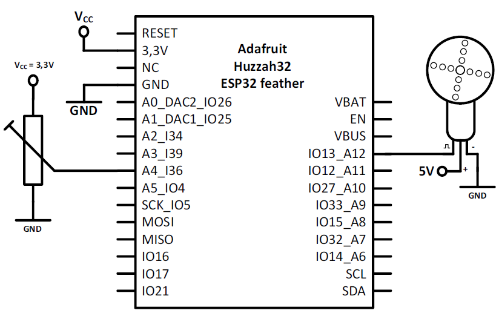

---
mathjax:
  presets: '\def\lr#1#2#3{\left#1#2\right#3}'
---
# Servomotoren

Een normale servomotor is een motor die we kunnen laten draaien tussen een hoek van 0° en 180°.
In de volgende figuur is er een afbeelding van een servomotor. Deze servomotor heeft drie aansluitingen.
Twee aansluitingen zijn voor de voedingsspanning en een derde aansluiting dient om een soort-PWMsignaal aan te sluiten. Afhankelijk van het PWM-signaal zal de motor draaien tussen de 0° en de 180°.



:::warning
In de low cost range van de servo motoren bestaan er twee soorten servo motoren. 
> - De ene kan verdraaien over een maximale hoek van 180°. Deze kan dus niet volledig ronddraaien. Eenmaal een signaal gestuurd zal de servo motor een poging doen om te hoekpositie te bereiken zoals aangegeven door het stuursignaal.
> - Het andere type is een volledig roterende (volle 360°) servo motor. Daar zal hetzelfde stuursignaal aanleiding geven om de snelheid van deze motor en ook de draairichting te bepalen.
Qua uitzicht en aansluitingen zien de beide motoren er hetzelfde uit.
:::

De frequentie van het PWM signaal is 50Hz. De periode bedraagt dan 20ms ($$\frac{1} {f} = T$$).
Als de breedte van de puls gelijk is aan 1,25ms dan is de hoek 0°.
Als de breedte van de puls gelijk is aan 1,75ms dan is de hoek 180°.



Bij 0° is de pulsbreedte 1,25ms en de periode 20ms.

$$  \delta = {Ton \over T} * 100\%  = {1,25ms \over 20ms} * 100\% = 6,25\% $$

Bij 90° is de pulsbreedte 1,50ms en de periode 20ms.

$$  \delta = {Ton \over T} * 100\%  = {1,50ms \over 20ms} * 100\% = 7,5\% $$


Bij 180° is de pulsbreedte 1,75ms en de periode 20ms.

$$  \delta = {Ton \over T} * 100\%  = {1,75ms \over 20ms} * 100\% = 8,75\% $$

:::details
Er bestaan ook industriële servo motoren. Die zijn heel nauwkeurig maar ook duur. Deze bezitten een precisie encoder die aangeeft op welk een positie de rotor van de motor staat. Die info wordt naar terug gestuurd naar complexe elektronica die dan de positie zal bijsturen. Deze worden veel gebruikt in industriële robots en positionerings mechanismen. 
Ook de low cost servootjes bezitten een encoder maar die is heel eenvoudig opgebouwd uit een regelbare weerstand. De waarde van die weerstand is dan een indicator van de positie van de servo. Er zit dus een heel klein beetje conrole elektronica in deze servo motoren.
:::



## Schema



:::warning
Deze lowcost servo motoren werken op een spanning van 5V. Ze werken minder goed op een spanning van 3,3V. Het stuursignaal mlag echter wel een 0-3,3V waarde hebben.
:::

## Software

Alhoewel er specifieke micropython bibliotheken bestaan voor servo motoren, kunnne die eenvoudig met een gewoon PWM configuratie worden ingesteld. 

> :bulb: **Opmerking:** Let wel dat niet alle duty cycle waarden kunnen worden gebruikt. Er is maar een beperkte range mogelijk om de uiterste waarden van de servo motor te bereiken.

```python

from machine import Pin,PWM
import time

sg90 = PWM(Pin(22, mode=Pin.OUT))
sg90.freq(50)

# 0.5ms/20ms = 0.025 = 2.5% duty cycle
# 2.4ms/20ms = 0.12 = 12% duty cycle

# 0.025*1024=25.6
# 0.12*1024=122.88

while True:
    sg90.duty(26)
    time.sleep(1)
    sg90.duty(123)
    time.sleep(1)
```

## Opdracht: Aansturen Servo motor (180°)

<div style="background-color:darkgreen; text-align:left; vertical-align:left; padding:15px;">
<p style="color:lightgreen; margin:10px">
Opdracht: Maak een programma waarbij je een servomotor gebruikt om een slagboom van een parkeergarage te besturen.
<ul style="color: white;">
<li>Maak gebruik van twee drukknoppen die zich op EPS32 shield bevinden. Met één knop open je de slagboom en met de andere knop sluit je de slagboom.</li>
<li>Zorg er ook voor dat je externe interrupts gebruikt voor de knoppen en dat je anti-dender voorziet voor de drukknoppen.</li>
<li>Laat het resultaat aan de docent zien.</li>

</ul>
</p>
</div>
