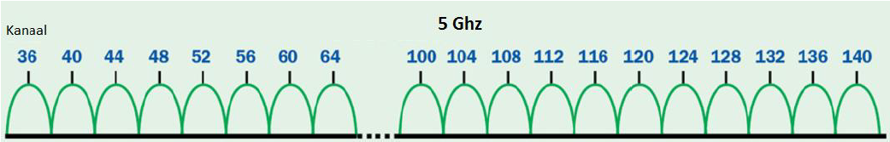

---
mathjax:
  presets: '\def\lr#1#2#3{\left#1#2\right#3}'
---

# WiFi

Wi-Fi werd oorspronkelijk uitgesproken als 'waifi'. Tegenwoordig wordt het uitgesproken als ‘wifi’ of soms ‘wɑjfɑj’. De naam Wi-Fi staat dan voor Wireless Fidelity.

## Ad-hoc mode of WiFi direct

In ad-hocmodus communiceert een 802.11-client `direct met een andere client`. De maximale afstand tussen deze stations is daarmee automatisch begrensd tot het bereik van de beide zenders/ontvangers (afhankelijk van vele factoren, echter meestal maximaal zo'n 30 meter).

## Infrastructure mode

In infrastructuurmodus wordt gewerkt met basisstations, in 802.11-termen `acces point` genoemd. De basisstations zijn onderling verbonden door een ethernet-infrastructuur.

Mobiele stations kunnen overschakelen van het ene naar het andere access point ('roamen'), zonder de verbinding met het netwerk te verliezen.

De bandbreedte en het bereik van wifi zijn groter dan die van bluetooth. Om deze redenen is wifi een van de belangrijkste toegangsmethoden voor een alom aanwezig draadloos internet.
Een keerzijde van wifi, met name vergeleken met bluetooth, is het relatief hoge energieverbruik. Dit kan bij kleine apparaten met een beperkte batterijcapaciteit een probleem geven.

## Licentieloos

Wi-Fi-apparatuur valt binnen de EU onder Short Range Devices. De voorwaarden voor licentievrij gebruik stellen beperkingen aan het uitgezonden vermogen.
In België is dit voor de 2,4GHz 100mW E.I.R.P. (Equivalent Isotropically Radiated Power) of 20 dBm.
Voor de 5GHz is dit 200mW of 30dBm voor binnen en voor buiten 1W.
In sommige landen is 500mW toegestaan. Er zijn daarom ook wifi-apparaatjes te koop van 500 mW, waarbij men soms een bereik claimt van 1000 meter. Let wel op het wettelijke zendvermogen van het land. Met speciale richtantennes is met 100 mW een afstand van 500 meter te overbruggen.

## Aanmelden op een WiFi netwerk

Als je met een toestel een verbinding wil maken met een wifi netwerk dan moet je de naam van het netwerk of SSID (Service Set Identifier) invullen samen met een wachtwoord.
Deze worden beide in de router of in het acces-point ingesteld. In Figuur 70 is een afbeelding van een sticker op een router afgebeeld. Op de sticker staan de namen van de twee draadloze netwerken van zowel de 2,4 als de 5GHz frequentieband. Op de sticker staat ook het paswoord. In de router kan altijd de SSID-naam als het paswoord gewijzigd worden.

## Versleuteling

Een belangrijk aandachtspunt bij wifinetwerken is de beveiliging van de door de ether verzonden informatie. Een wifiverbinding kan door middel van verschillende technieken worden versleuteld. De twee meest gebruikte standaarden zijn WEP (Wired Equivalent Privacy) en WPA (Wifi Protected Acces).

De WPA-standaard is in juni 2004 gestandaardiseerd als IEEE 802.11i, en WPA2, een verbetering op WPA, is sinds 2006 wijd in gebruik en vereist voor apparatuur met Wi-Fi-certificatie. 
WEP-beveiliging blijkt in de praktijk makkelijk te kraken; WPA of WPA2 worden daarom aanbevolen. WPA is slechts met zeer veel moeite te kraken, en WPA2 niet of nauwelijks. In oktober 2017 werd echter bekend dat wifinetwerken wereldwijd kwetsbaar zijn door meerdere beveiligingslekken in de WPA2-beveiliging.
In januari 2018 werd door de Wi-Fi Alliance WPA3 aangekondigd.

## WiFi versies

### Wifi 1 (802.11b)

De 802.11b standaard is in 1999 in dienst genomen en werkt op 2,4GHz frequentieband met een half duplex verbinding van 1 tot 11Mbit/s. Half-duplex wil zeggen dat er gecommuniceerd kan worden in beide richtingen maar niet op hetzelfde moment.

### Wifi 2 (802.11a)

Wifi 2 is in dienst genomen in 1999 en werkt op de 5GHz band met een half-duplex verbinding van 1 tot 54Mbit/s.

### Wifi 3 (802.11g)

In 2003 is Wifi 3 in 2003 in dienst genomen met een snelheid van 3 tot 54Mbit/s op de 2,4GHz band met een half-duplex verbinding.

### Wifi 4 (802.11n)

Vanaf Wifi 4 worden er twee frequentiebanden gebruikt. Namelijk de 2,4GHz en de 5GHz. Dit was in 2008. De communicatie is half-duplex met een snelheid van 72 tot 600Mbit/s. Deze standaard wordt momenteel nog heel veel gebruikt. Wifi 4 is de eerste standaard die MIMO ondersteunt en zo tegemoetkomt aan het steeds groter wordende aantal toestellen dat draadloos met een router wil verbinden.

### Wifi 5 (802.11ac)

Wifi 5 ondersteund enkel de 5GHz frequentieband met een snelheid van 433 tot 6933 Mbit/s. De 802.11ac is in dienst genomen in 2014 en is ook half duplex.

### Wifi 6 (802.11ax)

802.11ax is ook een half-duplex verbinding met snelheden tussen de 600 en 9608 Mbit/s die in 2019 in dienst is genomen met frequentiebanden van 2,4GHz en 5GHz. Wifi 6E gebruikt ook de 6GHz band.
Wifi 6 is stabieler, sneller en kan meer gelijktijdige gebruikers van Wifi voorzien.

## Frequentiebanden

De gebruikte licentievrijbanden van 2,4 GHz en 5 GHz worden gedeeld door verschillende gebruikers. Wifi 6E gebruikt ook nog de frequentieband van 6GHz.

### De 2,4GHz frequentieband

De 2,4GHz-band is dezelfde band waarin ook microgolfovens werken (voor verhitten van onder meer voedsel), maar vele draadloze toepassingen maken gebruik van dezelfde band, zoals draadloze muizen en toetsenborden (Bluetooth), draadloze deurbellen, draadloze camera’s, garagedeuropenener, hooftelefoons en veel andere apparatuur.

Bij ingebruikname van deze apparatuur wordt aangeraden om de 13 verschillende kanalen binnen de 2,4GHz-band te bekijken en het kanaal met de minste storing te kiezen.

De verschillende kanalen overlappen elkaar en kunnen daarom elkaar storen. Eigenlijk zijn er maar drie goeie kanalen namelijk kanaal 1, 6 en 11. Ieder kanaal heeft een kanaalbreedte van 20MHz. Sommige accespoints kan je ook laten werken met een kanaalbreedte van 40MHz maar het is aan ter raden om dit niet te gebruiken omdat er dan nog minder kanalen zijn om storingsvrij te kunnen gebruiken.

### De 5GHz frequentieband

De 5GHz-band kent minder concurrerende gebruikers, maar doordat het gebruik van deze band naar verwachting zal toenemen zal de onderlinge verstoring ook groter worden. De effecten die de gebruiker kan merken zijn: wegvallende dataverbindingen, beeldverstoring, niet-functionerende draadloze bediening. In de volgende figuur zijn links de kanalen afgebeeld voor binnen en rechts de kanalen die buiten gebruikt worden.

Het voordeel bij de 5GHz band is dat de kanalen elkaar niet overlappen en elkaar niet storen.

De 5GHz moet ook gedeeld worden met weerradars, maritieme, luchtvaart en radars van defensie. DFS staat voor Dynamic Frequency Select en is bij wet verplicht daar gebruik van te maken in geheel Europa. Deze techniek is in de 5GHz router ingebouwd? Deze techniek zorgt er voor dat allerhande radars ongestoord hun werk kunnen uitvoeren. 

DFS zorgt ervoor dat je AP bij het in dienst stellen gaat scannen op al de beschikbare wifi kanalen. Vooraleer die een signaal gaat gaan uitzenden. Dit om vast te stellen of er een radarsignaal te zien is. Als er geen radarsignaal op bepaalde kanalen gedetecteerd worden start het AP met uitzenden. 

Indien er een radar detectie wordt opgemerkt zorgt DFS ervoor dat het AP zo vlug mogelijk het kanaal verlaat. Als er geen vrij kanaal beschikbaar is moet in het slechtste geval het acces point het zwijgen worden opgelegd. Dit heeft als resultaat dat de wifi link soms volledig kan wegvallen en dit is uiteraard vervelend. 

Sommige linken kunnen soms tot meer dan 10 minuten offline blijven totdat het radarsysteem is verdwenen.

### De 6GHz frequentieband

Deze frequentieband wordt gebruikt in de Wifi 6E standaard. Op deze band is er een kanaalbreedte van 1200MHz die te verdelen is in 59 verschillende kanalen van 20MHz breed.

