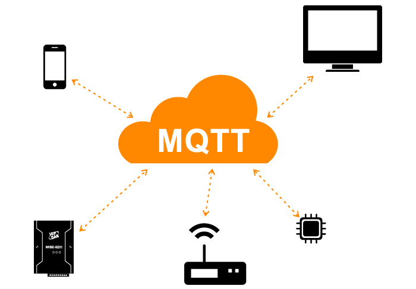
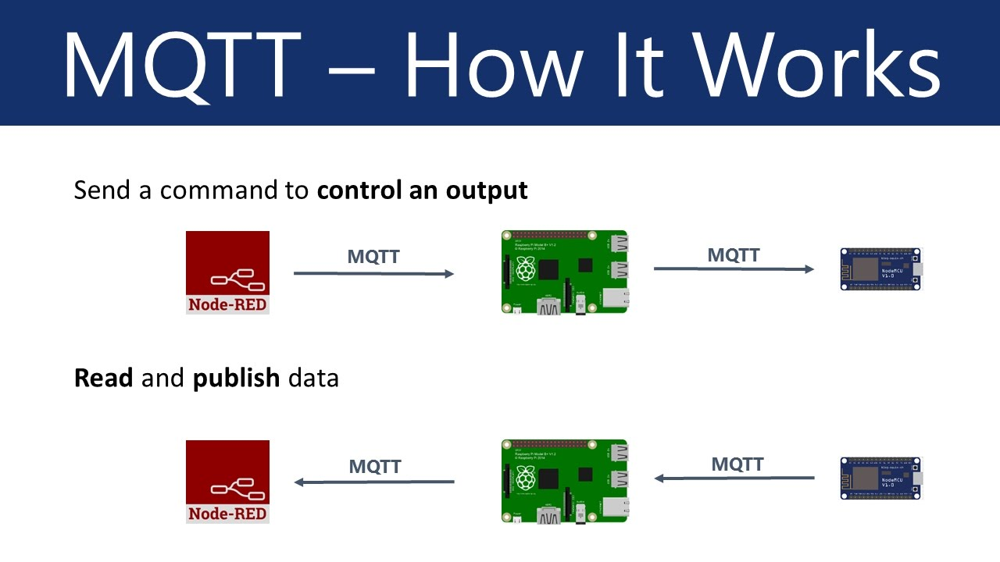
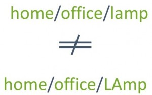
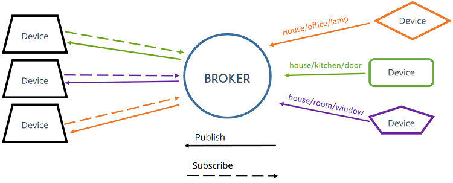

---
mathjax:
  presets: '\def\lr#1#2#3{\left#1#2\right#3}'
---

# MQTT  

---

## Inleiding

MQTT staat voor MQ Telemetry Transport. Het is een publish / subscribe, extreem eenvoudig en lichtgewicht messaging-protocol, ontworpen voor beperkte apparaten met een lage bandbreedte, hoge latentie (sterk vertragend werkende netwerken) of onbetrouwbare netwerken. De ontwerpprincipes zijn om de bandbreedte van het netwerk en de apparaatvereisten te minimaliseren en tegelijkertijd te proberen betrouwbaarheid en een zekere mate van zekerheid van levering te garanderen. Deze principes blijken het protocol ook ideaal te maken voor de opkomende "machine-to-machine"(M2M) of "Internet of Things-wereld van verbonden apparaten, en voor mobiele toepassingen waar bandbreedte en batterijvermogen beperkt zijn.  

MQTT was invented by Dr Andy Stanford-Clark of IBM, and Arlen Nipper of Arcom (now Eurotech), in 1999.

---

MQTT has been widely implemented across a variety of industries since 1999.  
[YouTube](https://www.youtube.com/watch?v=NtyyfcYQxa4)

---  

Vanaf maart 2013 is MQTT bezig met standaardisatie bij OASIS. De protocolspecialisatie is al vele jaren openlijk gepubliceerd met een royalty vrije licentie en bedrijven zoals Eurotech (voorheen bekend als Arcom) hebben het protocol geïmplementeerd in hun producten. In november 2011 kondigden IBM en Eurotech hun gezamenlijke deelname aan de Eclipse M2M Industry Working Group en de schenking van MQTT-code aan het voorgestelde Eclipse Paho-project aan.

---

TCP/IP-poort 1883 is gereserveerd bij IANA voor gebruik met MQTT. TCP/IP-poort 8883 is ook geregistreerd voor het gebruik van MQTT via SSL.

---

MQTT is speciaal gebouwd om communicatie over een TCP/IP netwerk te vereenvoudigen. Het communiceren binnen dit protocol zou kunnen gerealiseerd worden door enerzijds een server op te zetten en anderzijds een client. De server zou in dit geval zo zijn ingesteld dat die luistert op een bepaalde poort voor inkomende pakketjes (request). Deze zouden van een client zijn verzonden naar de server (al of niet via DNS of rechtstreeks naar een TCP/IP adres). Hierop zou de server een antwoord sturen naar de client. Een typisch voorbeeld van een dergelijke werking is het HTTP-protocol. Dit protocol draait bovenop het TCP/IP protocol. (HTTP trekt zich niets aan hoe, en langswaar de datapakketjes hun weg zoeken van zender naar ontvanger). Hierbij wordt de poort 80 gebruikt al request kanaal. Een random (gekozen door de client) poort ergens boven de 1024 zou dan als antwoord kanaal gebruikt worden. Tussenliggende routers en switchen zorgen dat de pakketjes heen en weer worden verzonden en de juiste bestemming bereikt.

Voor dergelijke toepassingen moeten een Socket geprogrammeerd worden. Een Socket is een stuk code die de computer (of het netwerk device) in staat stelt om naar een poort adres te luisteren tot een inkomend pakket arriveert. Dit is niet zo eenvoudig te programmeren. Het gebruiken van een MQTT protocol boven het TCP/IP stelt de gebruiker in staat om eenvoudige data te versturen van een client naar een server (publish). Het protocol zorgt ervoor dat het antwoord van de server niet alleen naar de client wordt teruggestuurd, maar dat het ook aan een eventuele geïntereseerde (of meerdere) (subscribers) zal worden medegedeeld.

  

---

Stel, je wilt het licht meten met een lichtsensor op een bepaalde plaats. Je wilt ook die gemeten lichtsterkte (waarschijnlijk een analoog getal??, bij een detector zou een digitaal getal volstaan) doorgeven aan een ander device (aangesloten op het internet, bedraad of mobiel). Dan kan je hiervoor het MQTT protocol gebruiken. Hierbij zal het device die het licht meet, ook moeten verbonden zijn aan het internet. Dit device kan zijn data (lichtsterkte) door sturen naar een server. De server wordt bij MQTT een Broker genoemd. De lichtsterkte wordt dus gepubliceerd op de Broker. Dit zal gebeuren in een specifieke `topic` op de broker.

Een sensor (temperatuur en/of licht) kan de gemeten waarde doorsturen naar de Broker. Dit kan eenmalig zijn of continue. De Broker zal deze gegevens opslaan in een specifieke `topic`. Een gebouwbeheersapplicatie kan zich abonneren op deze gegevens (`topic`) en zal dus deze waarden weten / kennen / doorgestuurd krijgen. Bij bepaalde sensorwaarden kan de gebouwenbeheersapplicatie beslissen om bijvoorbeeld de rolluiken neer te laten. Hiervoor gebruikt de applicatie ook de Broker om via een andere (of dezelfde, maar dan wordt het een beetje ingewikkeld) `topic` een commando te sturen (publishen) naar het device die de rolluiken kan activeren (dit device is dus een subscriber op deze laatste topic).

De node die de rolluiken bediend is op zijn beurt geabonneerd (subscribed) op de `topic` en zal de rolluiken activeren. Eventueel kan nu nog een controle worden ingebouwd door de rolluiken node via een eindeloopsensor op de rolluik het einde van het proces te laten bevestigen naar de beheersapplicatie. Dit kan opnieuw via de Broker worden uitgevoerd.

---

Het MQTT protocol is dus een berichten wachtrij systeem voor lichtgewichte data. Het is tevens een asynchroon communicatiemodel dat werkt op berichten op basis van een bepaalde gebeurtenis (event). Het protocol voorziet een beperkte overhead (2 bytes) zodat het heel geschikt is voor netwerken met een lage bandbreedte (lees: geschikt voor trage netwerken).
Zoals in het voorbeeld duidelijk werd gesteld, werkt het protocol volgens een publish (publiceer een `topic`) en subscribe (abonneer op een `topic`) model. Er is dus een ontkoppeling van dataproducent (publisher) en dataconsument (subscriber) door `topic`s (berichtenwachtrijen). Het is een eenvoudig protocol, gericht op een lage complexiteit, een laag stroomverbruik en implementaties met weinig footprint zoals WSN netwerken (WSN = Wireless Sensor Networks).
Het protocol werkt via een connection-oriented verbinding (TCP). Door het lichtgewicht protocol is MQTT erg geschikt bij (draadloze) netwerkverstoringen.

---

## Hoe het werkt, technische achtergrond  

Dit protocol werkt dus bovenop het TCP/IP protocol. Vandaar dat er hier geen rekening moet gehouden worden met problematieken omtrent DNS, poorten, adressen, ... Het is dus een lichtgewicht protocol die toch heel sterk vertegenwoordigd is binnen IoT-systemen. Het protocol laat zowel het publiceren als het abonneren van berichten (data) toe door een client.  

  

MQTT is een eenvoudig berichten protocol ontworpen voor apparaten met een beperkte bandbreedte (lees, de berichten bevatten beperkt aantal bytes). Hierdoor leent dit protocol zich perfect voor Internet of Things applicaties.  MQTT laat toe om berichten te verzenden die ergens outputs kunnen aansturen, of toestanden van detectoren en waarden van sensoren kan versturen (publiceren).

Hiervoor wordt er een eenvoudige communicatie opgezet tussen meerdere devices.

[Youtube](https://www.youtube.com/watch?time_continue=1&v=EIxdz-2rhLs&feature=emb_logo)

## High Level Overview

De volgende figuren vatten eigenlijk heel kort samen wat het MQTT protocol kan realiseren.

Er kan een bericht verzonden worden met een client om een output aan te sturen.

Of je kan data lezen van een sensor of detector (binaire toestand ervan) met een client.

Uitleg bij vorige figuren: Laat je niet misleiden door de naam Node-Red. Dit staat voor een client. Een client kan (meestal) een mobile device zijn die als dashboard functioneert binnen het IoT-systeem. Een dashboard is een scherm waarmee toestanden van detectoren/sensoren kan worden gevisualiseerd en waarmee outputs (actuatoren) kunnen worden aangestuurd. 

Er dient nog opgemerkt te worden dat devices nooit rechtstreeks met elkaat communiceren. Alle MQTT berechten binnen een IoT-systeem worden met elkaar uitgewisseld via een Broker. In vorige figuren voorgesteld door een Raspberry PI. Dit kan evengoed iets anders zijn (een vaste server of bij professionele applicaties, een cloudservice).

## MQTT Basics

Om te werken met MQTT zijn volgende concepten belangrijk. Het is noodzakelijk om deze concepten te begrijpen:

> - Publish / Subscribe
> - Messages (berichten)
> - Topics
> - Broker
> - Client

## MQTT - Publish / Subscribe

In een publish en subscribe systeem kan een device (client) berichten publiceren in een topic op de broker. Evenals kan een device (client) geabonneerd zijn op een topic op de broker.

## Messages

Messages zijn de berichten die de data (informatie) bevatten over de toestand van een detector/sensor of over de toestand die een output moet aannemen bij een actuator (dit is dan een commando). De vorm van zo'n bericht is een string waarin de informatie staat. Bijvoorbeeld `temp=25` of `ventilatorAan` . Dit wordt vrij gekozen door de IoT-ontwikkelaar en moet duidelijk zijn voor beide clients.

## MQTT - Topics

Zoals al eerder opgemerkt worden Messages tussen clients uitgewisseld via een Broker (server binnen het Iot_systeem). Om toe te laten dat een broker meerdere subscribers en publishers kan verwerken, is deze georganiseerd met topics. Topics zijn hiërarchisch georganiseerd. Ze zijn een beetje te vergelijken met de mappenstructuur op een computersysteem.

Op een topic kan een publiceerder zijn message publiceren. Een subscriber op die topic zal dan die message ontvangen (dit is de taak van de broker).  

Topics zijn strings met forward slash. Deze slash zorgt voor de hiërarchie tussen verschillende topics. Iedere slash representateert dus een `level` . Volgend voorbeeld zou een topic kunnen zijn die de lamp in een bureau voorstelt (aanstuurt).  

  

Topics zijn case-sensitive.

  

Dit zou een voorbeeld kunnen zijn van deze applicatie met een topic op de broker en een message in die topic :

  

Het bericht dat in de topic komt te staan (gepubliceerd door een MQTT client publisher) is dus hier de string: "ON" of de string: "OFF". Andere strings zullen hier geen betekenis hebben.  

Daarop zal de subscriber (ook een MQTT client), reageren door de digitale output (waar de lamp is op aangesloten) hoog of laag te brengen.

## MQTT - Topics - Wildcards

In MQTT, de topicnaam refereert naar een UTF-8 string formaat. De naam wordt gebruikt om een hiërarisch onderscheid te maken tussen de verschillende topics. Op die manier kunnen verschillende berichte gefilterd worden voor verschillende clients. De hierarchie wordt opgemaakt door verschillende levels in de topics toe te laten. Een topic level wordt gescheiden door een forward slash / (topic level separator).

  

In vergelijking met een berichten queue, MQTT topics zijn zeer licht van gewicht om de belasting op de bandbreedte en datadebiet beperkt te houden. Er is geen nood aan om de topics op voorhand te declareren en te initialiseren.  De broker aanvaardt iedere geldige topic zonder enige voorafgaande initialisatie.

Enkele voorbeelden van topics:

>myhome/groundfloor/livingroom/temperature
USA/California/San Francisco/Silicon Valley
5ff4a2ce-e485-40f4-826c-b1a5d81be9b6/status
Germany/Bavaria/car/2382340923453/latitude

Merk op dat elke topic ten minste één teken moet bevatten en dat de onderwerpstring lege spaties toelaat. Topics zijn hoofdlettergevoelig. `Myhome/temperature` en `MyHome/Temperature` zijn bijvoorbeeld twee verschillende topics. Bovendien is alleen een forward slash een geldige topic.

Wanneer een client zich abonneert op een topic, kan hij zich abonneren op het exacte topic van een gepubliceerd bericht of kan hij wildcards gebruiken om zich tegelijkertijd op meerdere topics te abonneren. Een wildcard kan alleen worden gebruikt om u op topics te abonneren, niet om een ​​bericht te publiceren. Er zijn twee verschillende soorten wildcards: één niveau en meerdere niveaus.

**Single Level: +**

Zoals de titel suggereert, vervangt een single-level wildcard één topic level. Het plusteken staat voor een wildcard op één levelg in een topic.

  

Elke topic komt overeen met een onderwerp met een wildcard op één level als het een willekeurige tekenreeks bevat in plaats van de wildcard. Een abonnement op myhome/groundfloor/+/temperature kan bijvoorbeeld de volgende resultaten opleveren:

  

**Multi Level: #**

Het wildcardteken met meerdere levels omvat veel topiclevels. Het hash-symbool vertegenwoordigt de wildcard met meerdere levels in een topic. Om de makelaar te laten bepalen welke topics overeenkomen, moet het wildcardteken met meerdere niveaus als laatste teken in het onderwerp worden geplaatst en worden voorafgegaan door een forward slash.

  

  

Wanneer een client zich abonneert op een onderwerp met een jokerteken met meerdere niveaus, ontvangt hij alle berichten van een topic dat begint met het patroon vóór het wildcardteken, ongeacht hoe lang of diep het onderwerp is. Als u alleen het wildcardteken met meerdere levels opgeeft als onderwerp (#), ontvangt u alle berichten die naar de MQTT-broker worden verzonden. Als u een hoge doorvoer verwacht, is een abonnement met alleen een wildcardteken met meerdere levels en een antipatroon aangewezen (zie de best practices hieronder).

**Topic onderwerpen die beginnen met \$**
Over het algemeen kunt u uw MQTT-onderwerpen een naam geven zoals u dat wilt. Er is echter één uitzondering: onderwerpen die beginnen met een \$-symbool hebben een ander doel. Deze onderwerpen maken geen deel uit van het abonnement wanneer u zich abonneert op het wildcardteken met meerdere niveaus als onderwerp (#). De \$-symbol-onderwerpen zijn gereserveerd voor interne statistieken van de MQTT-broker. Cliënten kunnen geen berichten over deze onderwerpen publiceren. Op dit moment is er geen officiële standaardisatie voor dergelijke onderwerpen. Gewoonlijk wordt \$ SYS / gebruikt voor alle volgende informatie, maar de implementaties van broker variëren. Een suggestie voor \$ SYS-onderwerpen is in de MQTT GitHub wiki. Hier zijn enkele voorbeelden:

\$SYS/broker/clients/connected
\$SYS/broker/clients/disconnected
\$SYS/broker/clients/total
\$SYS/broker/messages/sent
\$SYS/broker/uptime

**Samenvatting topics**

Dit zijn de basisprincipes van MQTT-berichtonderwerpen. Zoals u kunt zien, zijn MQTT-onderwerpen dynamisch en bieden ze een grote flexibiliteit. Wanneer u wildcardtekens gebruikt in toepassingen in de echte wereld, zijn er enkele uitdagingen waar u op moet letten. We hebben de best practices verzameld die we hebben geleerd door uitgebreid met MQTT samen te werken in verschillende projecten en staan ​​altijd open voor suggesties of een discussie over deze praktijken. Gebruik de opmerkingen om een ​​gesprek te beginnen, laat ons uw best practices weten of als u het niet eens bent met een van de onze!

**Best practices topics**

*Gebruik nooit een voorwaartse slash*
Een voorwaartse slash is toegestaan ​​in MQTT. Bijvoorbeeld /mijnwoning/beganegrond/woonkamer. De forward slash introduceert echter een onnodig onderwerpniveau met een nul-teken vooraan. De nul levert geen enkel voordeel op en leidt vaak tot verwarring.

*Gebruik nooit spaties in een onderwerp*
Een spatie is de natuurlijke vijand van elke programmeur. Als dingen niet gaan zoals ze zouden moeten, maken spaties het veel moeilijker om onderwerpen te lezen en te debuggen. Net als bij forward slashes, wil dat nog niet zeggen dat iets moet worden gebruikt. UTF-8 heeft veel verschillende typen witruimte, dergelijke ongebruikelijke tekens moeten worden vermeden.

*Houd het onderwerp kort en bondig*
Elk onderwerp is opgenomen in elk bericht waarin het wordt gebruikt. Maak uw onderwerpen zo kort en beknopt mogelijk. Als het om kleine apparaten gaat, telt elke byte en heeft de lengte van het onderwerp een grote impact.

*Gebruik alleen ASCII-tekens, vermijd niet-afdrukbare tekens*
Omdat niet-ASCII UTF-8-tekens vaak onjuist worden weergegeven, is het erg moeilijk om typfouten of problemen met de tekenset te vinden. Tenzij het absoluut noodzakelijk is, raden we aan om het gebruik van niet-ASCII-tekens in een onderwerp te vermijden.

*Voeg een unieke identificatie of de klant-ID in het onderwerp in*
Het kan erg handig zijn om de unieke ID van de publicerende client in het onderwerp op te nemen. De unieke identificatie in het onderwerp helpt u te identificeren wie het bericht heeft verzonden. De ingesloten ID kan worden gebruikt om autorisatie af te dwingen. Alleen een klant die dezelfde klant-ID heeft als de ID in het onderwerp, mag naar dat onderwerp publiceren. Een client met de client1-ID mag bijvoorbeeld publiceren naar client1/status, maar niet naar client2/status.

*Abonneer je niet op #*
Soms is het nodig om u te abonneren op alle berichten die via de broker worden verzonden. Om bijvoorbeeld alle berichten in een database te bewaren. Abonneer u niet op alle berichten op een broker door een MQTT-client te gebruiken en u te abonneren op een wildcardteken met meerdere niveaus. Vaak is de abonnerende client niet in staat om de belasting van berichten die het resultaat zijn van deze methode te verwerken (vooral als u een enorme doorvoer heeft). Onze aanbeveling is om een ​​extensie te implementeren in de MQTT-broker. 

*Vergeet de uitbreidbaarheid niet*
Onderwerpen zijn een flexibel concept en u hoeft ze op geen enkele manier vooraf toe te wijzen. Zowel de uitgever als de abonnee moeten echter op de hoogte zijn van het onderwerp. Het is belangrijk om na te denken over hoe onderwerpen kunnen worden uitgebreid om nieuwe functies of producten mogelijk te maken. Als uw smarthome-oplossing bijvoorbeeld nieuwe sensoren toevoegt, zou het mogelijk moeten zijn om deze aan uw topicboom toe te voegen zonder de hele topichiërarchie te veranderen.

*Gebruik specifieke onderwerpen, geen algemene*
Als je onderwerpen een naam geeft, gebruik ze dan niet op dezelfde manier als in een wachtrij. Onderscheid uw onderwerpen zo veel mogelijk. Als je bijvoorbeeld drie sensoren in je woonkamer hebt, maak dan onderwerpen aan voor `mijnhuis/woonkamer/temperatuur`, `mijnhuis/woonkamer/helderheid` en `mijnhuis/woonkamer/vochtigheid`. Stuur niet alle waarden over `mijnhuis/woonkamer`. Het gebruik van één onderwerp voor alle berichten is een antipatroon. Specifieke naamgeving maakt het u ook mogelijk om andere MQTT-functies te gebruiken, zoals bewaarde berichten.  

## MQTT - Broker

Zoals eerder aangehaald speelt de Broker een cruciale rol in de werking van het MQTT protocol. Zonder kan dit niet werken. Een Broker kan beveiligd worden zodat niet iedereen zomaar in een topic kan schrijven(publish) / lezen(subscribe).

Een boker bevat dus topic volgens een hierargische structuur. Zie hoofdstuk met topics.  

  

De broker is primair verantwoordelijk voor het ontvangen van alle berichten, het filteren van de berichten, beslissen wie erin geïnteresseerd is (abonnee) en vervolgens het bericht verzende (publiceren) naar alle geabonneerde clients.

Een broker kan zelf gemaakt worden op een computer, raspberryPI of zelfs in de cloud bij Amazon of Azure op een virtuele machine. Hier een voorbeeld van een broker gemaakt met raspberryPi gebruik maakende van Node_red (kan ook in python worden geconfigureerd op een RPI):

  

## MQTT - QOS

De term 'Quality Of Service' is een term die iets zegt over de manier waarop de data tussen client en broker kan worden uitgewisseld, laten we eens kijken wat deze term precies betekent.

Het Quality of Service (QoS) -niveau is een overeenkomst tussen de afzender van een bericht en de ontvanger van een bericht die de garantie van aflevering van een specifiek bericht definieert. Er zijn 3 QoS-niveaus in MQTT:

* Maximaal één keer (0)
* Minstens een keer (1)
* Precies één keer (2).

Als je het hebt over QoS in MQTT, moet je rekening houden met de twee kanten van berichtbezorging:

1. Berichtaflevering van de publicerende client naar de broker.
2. Levering van berichten van de broker naar de abonnerende client.

We zullen de twee kanten van de berichtbezorging afzonderlijk bekijken, omdat er subtiele verschillen tussen de twee zijn. De client die het bericht naar de broker publiceert, bepaalt het QoS-niveau van het bericht wanneer het het bericht naar de broker verzendt. De broker verzendt dit bericht naar abonneeclients met behulp van het QoS-niveau dat elke abonneecliënt definieert tijdens het inschrijvingsproces. Als de abonnerende client een lagere QoS definieert dan de publicerende klant, verzendt de broker het bericht met de lagere servicekwaliteit.

**Waarom is servicekwaliteit belangrijk?**
QoS is een belangrijk kenmerk van het MQTT-protocol. QoS geeft de klant de mogelijkheid om een ​​serviceniveau te kiezen dat past bij de netwerkbetrouwbaarheid en toepassingslogica. Omdat MQTT de herverzending van berichten beheert en bezorging garandeert (zelfs als het onderliggende transport niet betrouwbaar is), maakt QoS communicatie in onbetrouwbare netwerken een stuk eenvoudiger.

**Hoe werkt het?**
Laten we eens nader bekijken hoe elk QoS-niveau wordt geïmplementeerd in het MQTT-protocol en hoe het werkt:

**QoS 0 - maximaal één keer**
Het minimale QoS-niveau is nul. Dit serviceniveau garandeert een optimale levering. Er is geen garantie op levering. De ontvanger bevestigt de ontvangst van het bericht niet en het bericht wordt niet opgeslagen en opnieuw verzonden door de afzender. QoS level 0 wordt vaak **fire and forget** genoemd en biedt dezelfde garantie als het onderliggende TCP-protocol.

  

**QoS 1 - minstens één keer**
QoS-niveau 1 garandeert dat een bericht ten minste één keer bij de ontvanger wordt afgeleverd. De afzender slaat het bericht op totdat hij een PUBACK-pakket ontvangt van de ontvanger dat de ontvangst van het bericht bevestigt. Het is mogelijk dat een bericht meerdere keren wordt verzonden of afgeleverd.

  

  

De afzender gebruikt de pakketidentificatie in elk pakket om het PUBLISH-pakket te matchen met het corresponderende PUBACK-pakket. Als de afzender een PUBACK-pakket niet binnen een redelijke tijd ontvangt, verzendt de afzender het PUBLISH-pakket opnieuw. Wanneer een ontvanger een bericht ontvangt met QoS 1, kan deze dit onmiddellijk verwerken. Als de ontvanger bijvoorbeeld een broker is, stuurt de broker het bericht naar alle abonnees en antwoordt hij met een PUBACK-pakket.

Als de publicerende client het bericht opnieuw verzendt, wordt een dubbele (DUP) vlag ingesteld. In QoS 1 wordt deze DUP-vlag alleen gebruikt voor interne doeleinden en wordt niet verwerkt door broker of client. De ontvanger van het bericht stuurt een PUBACK, ongeacht de DUP-vlag.

**QoS 2 - precies één keer**
QoS 2 is het hoogste serviceniveau in MQTT. Dit niveau garandeert dat elk bericht slechts één keer wordt ontvangen door de beoogde ontvangers. QoS 2 is het veiligste en langzaamste serviceniveau. De garantie wordt geboden door minimaal twee vraag- / antwoordstromen (een vierdelige handshake) tussen de zender en de ontvanger. De afzender en ontvanger gebruiken de pakket-ID van het originele PUBLISH-bericht om de bezorging van het bericht te coördineren.

  

Wanneer een ontvanger een QoS 2 PUBLISH-pakket van een afzender ontvangt, verwerkt deze het publicatiebericht dienovereenkomstig en beantwoordt het de afzender met een PUBREC-pakket dat het PUBLISH-pakket bevestigt. Als de afzender geen PUBREC-pakket van de ontvanger ontvangt, verzendt deze het PUBLISH-pakket opnieuw met een dubbele (DUP) -vlag totdat het een bevestiging ontvangt.

  

Zodra de afzender een PUBREC-pakket van de ontvanger heeft ontvangen, kan de afzender het oorspronkelijke PUBLISH-pakket veilig verwijderen. De afzender slaat het PUBREC-pakket van de ontvanger op en antwoordt met een PUBREL-pakket.

  

Nadat de ontvanger het PUBREL-pakket heeft ontvangen, kan het alle opgeslagen toestanden negeren en antwoorden met een PUBCOMP-pakket (hetzelfde geldt wanneer de afzender het PUBCOMP ontvangt). Totdat de ontvanger de verwerking heeft voltooid en het PUBCOMP-pakket terugstuurt naar de afzender, slaat de ontvanger een referentie op naar de pakket-ID van het originele PUBLISH-pakket. Deze stap is belangrijk om te voorkomen dat het bericht een tweede keer wordt verwerkt. Nadat de afzender het PUBCOMP-pakket heeft ontvangen, komt de pakket-ID van het gepubliceerde bericht beschikbaar voor hergebruik.

  

Wanneer de QoS 2-stroom is voltooid, zijn beide partijen er zeker van dat het bericht is afgeleverd en heeft de afzender een bevestiging van de aflevering.

Als onderweg een pakket verloren gaat, is de afzender verantwoordelijk om het bericht binnen een redelijke termijn opnieuw te verzenden. Dit geldt evenzeer als de afzender een MQTT-client of een MQTT-broker is. De ontvanger heeft de verantwoordelijkheid om dienovereenkomstig op elk opdrachtbericht te reageren.

**Goed om te weten**
Sommige aspecten van QoS zijn op het eerste gezicht niet erg duidelijk. Hier zijn een paar dingen om in gedachten te houden wanneer u QoS gebruikt:

*Downgrade van QoS*
Zoals we al zeiden, zijn de QoS-definitie en niveaus tussen de client die het bericht verzendt (publiceert) en de client die het bericht ontvangt twee verschillende dingen. De QoS-niveaus van deze twee interacties kunnen ook verschillen. De client die het PUBLISH-bericht naar de broker verzendt, definieert de QoS van het bericht. Wanneer de broker het bericht echter aan ontvangers (abonnees) bezorgt, gebruikt de broker de QoS die de ontvanger (abonnee) tijdens het abonnement heeft gedefinieerd. Klant A is bijvoorbeeld de afzender van het bericht. Klant B is de ontvanger van het bericht. Als klant B zich abonneert op de broker met QoS 1 en klant A verzendt het bericht naar de broker met QoS 2, dan bezorgt de broker het bericht aan klant B (ontvanger / abonnee) met QoS 1. Het bericht kan meer dan eens worden afgeleverd bij de klant B, omdat QoS 1 de aflevering van het bericht ten minste één keer garandeert en niet voorkomt dat hetzelfde bericht meerdere keren wordt afgeleverd.

*Pakket-ID's zijn uniek per klant*
De pakket-ID die MQTT gebruikt voor QoS 1 en QoS 2 is uniek tussen een specifieke cliënt en een broker binnen een interactie. Deze identifier is niet uniek tussen alle clients. Zodra de stroom is voltooid, is de pakketidentificatie beschikbaar voor hergebruik. Dit hergebruik is de reden waarom de pakket-ID niet hoger hoeft te zijn dan 65535. Het is onrealistisch dat een cliënt meer dan dit aantal berichten kan verzenden zonder een interactie te voltooien.

**Best Practice**
Hier zijn enkele richtlijnen die u kunnen helpen bij uw besluitvormingsproces voor het juiste QOS-niveau. De QoS die voor u geschikt is, hangt sterk af van uw gebruikssituatie.

*Gebruik QoS 0 wanneer ...*
* U heeft een geheel of grotendeels stabiele verbinding tussen zender en ontvanger. Een klassieke use case voor QoS 0 is het verbinden van een testclient of een front-end-applicatie met een MQTT-broker via een bekabelde verbinding.
* U vindt het niet erg als er af en toe een paar berichten verloren gaan. Het verlies van sommige berichten kan acceptabel zijn als de gegevens niet zo belangrijk zijn of als gegevens met korte tussenpozen worden verzonden
* U heeft geen wachtrij voor berichten nodig. Berichten worden alleen in de wachtrij geplaatst voor clients die geen verbinding hebben als ze QoS 1 of 2 hebben en een permanente sessie.

*Gebruik QoS 1 wanneer ...*
* U moet elk bericht ontvangen en uw use-case kan duplicaten aan. QoS-niveau 1 is het meest gebruikte serviceniveau omdat het garandeert dat het bericht minstens één keer aankomt, maar meerdere bezorgingen mogelijk maakt. Uiteraard moet uw aanvraag duplicaten tolereren en deze dienovereenkomstig kunnen verwerken.
* U kunt de overhead van QoS 2 niet dragen. QoS 1 levert berichten veel sneller af dan QoS 2.

*Gebruik QoS 2 wanneer ...*
Het is van cruciaal belang voor uw toepassing om alle berichten precies één keer te ontvangen. Dit is vaak het geval als een dubbele bezorging de gebruikers van toepassingen of abonnees kan schaden. Houd rekening met de overhead en dat de QoS 2-interactie meer tijd nodig heeft om te voltooien.

**Wachtrij van QoS 1- en 2-berichten**
Alle berichten die met QoS 1 en 2 worden verzonden, worden in de wachtrij geplaatst voor offline clients totdat de client weer beschikbaar is. Deze wachtrij is echter alleen mogelijk als de cliënt een aanhoudende sessie heeft.

