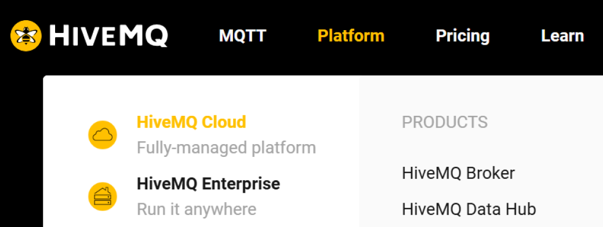
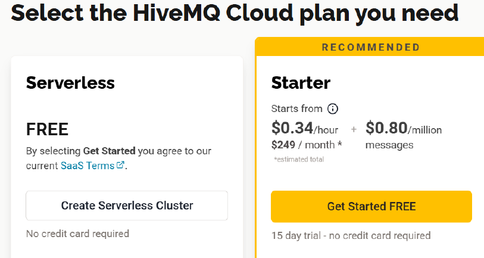
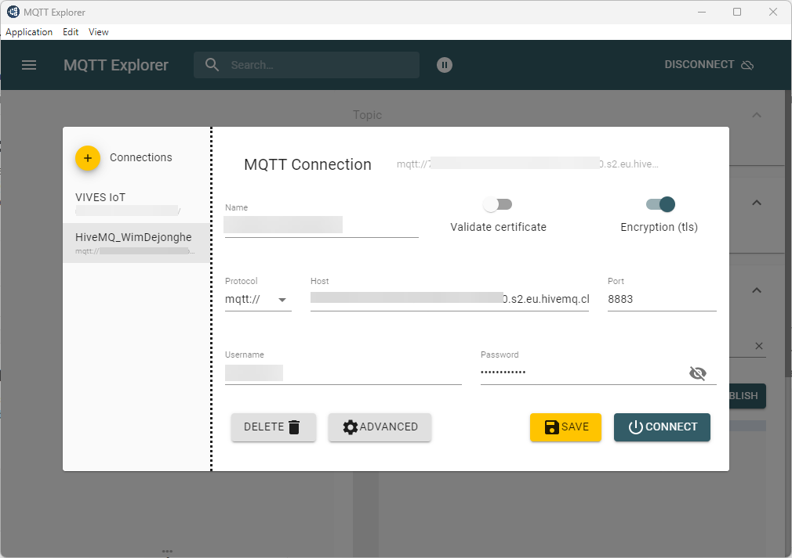
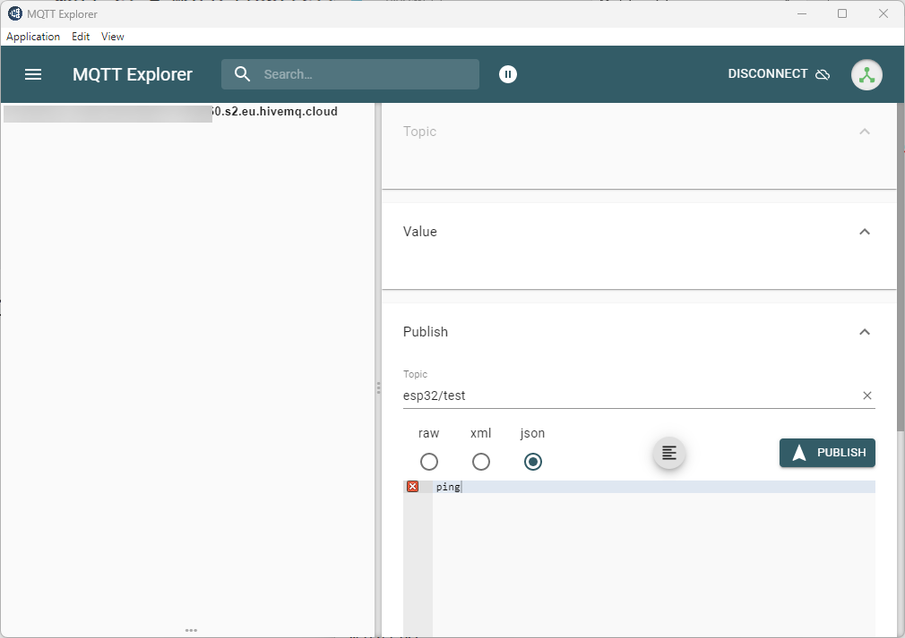

---
mathjax:
  presets: '\def\lr#1#2#3{\left#1#2\right#3}'
---

# ESP32 en MQTT

## Micropython code

```python
import network
import time
from umqtt.robust import MQTTClient
from machine import Pin, Timer
import sys 
import ssl

# Wi-Fi instellingen
SSID = "YOUR_SSID"
PASSWORD = "YOUR_PASSWORD"

# MQTT instellingen
MQTT_BROKER = "YOUR_BROKER"  # Gebruik een publieke broker of je eigen server vb: xxxxxxxxxxxxxx.s2.eu.hivemq.cloud
MQTT_CLIENT_ID = "YOUR_CLIENTID"
MQTT_USER = "YOUR_USERID"
MQTT_PASSWORD = "YOUR_PASSWORD"
MQTT_TOPIC_SUB = "YOUR_SUBSCRIBE_TOPIC"
MQTT_TOPIC_PUB = "YOUR_PUBLISH_TOPIC"

counter_SW1 = 0

sw1 = Pin(39, Pin.IN)
led = Pin(13, Pin.OUT)
led1 = Pin(21, Pin.OUT)


def timer_callback(timer):
    global led1
    led1.value(not led1.value())


def callback_sw1(p):
    #print('pin change', p)
    #led1.value(not led1.value())
    global counter_SW1
    tekst = f"SW1 ingedrukt: {counter_SW1}"
    client.publish(MQTT_TOPIC_PUB, tekst)
    counter_SW1 = counter_SW1 + 1


# Wi-Fi verbinden
def connect_wifi():
    wlan = network.WLAN(network.STA_IF)
    wlan.active(True)
    wlan.connect(SSID, PASSWORD)

    print("Verbinden met Wi-Fi...")
    while not wlan.isconnected():
        time.sleep(1)
    
    print("Verbonden! IP-adres:", wlan.ifconfig()[0])

# Callback functie voor ontvangen berichten
def on_message(topic, msg):
    print(f"Ontvangen: {topic.decode()} -> {msg.decode()}")
    
    # Hier kan je een actie uitvoeren bij een bepaald bericht
    if msg.decode() == "ping":
        client.publish(MQTT_TOPIC_PUB, "pong")
    if msg.decode() == "led":
        led.value(not led.value())

# Verbinden met Wi-Fi
connect_wifi()

# Verbinden met MQTT broker
context = ssl.SSLContext(ssl.PROTOCOL_TLS_CLIENT)
context.verify_mode = ssl.CERT_NONE
client = MQTTClient(client_id=MQTT_CLIENT_ID.encode(), server=MQTT_BROKER.encode(), port=0, user=MQTT_USER.encode(), password=MQTT_PASSWORD.encode(), keepalive=7200, ssl=context)
client.set_callback(on_message)
client.connect()
print(f"Verbonden met MQTT-broker")

# Abonneren op een topic
client.subscribe(MQTT_TOPIC_SUB)
print(f"Geabonneerd op topic {MQTT_TOPIC_SUB}")

# Publish een testbericht
client.publish(MQTT_TOPIC_PUB, "ESP32 is verbonden!")

#Interrupt instellen op dalende flank drukknop SW1
sw1.irq(trigger=Pin.IRQ_FALLING, handler=callback_sw1)

#Periodieke timer die tussendoor werkt. (knipperen van LED1, freq = 1Hz)
my_timer = Timer(3)
my_timer.init(mode=Timer.PERIODIC, freq=1, callback=timer_callback)

# Blijf berichten verwerken
try:
    while True:
        client.check_msg()  # Controleer of er een nieuw bericht is (niet blokkerend)
        time.sleep(0.01)
except KeyboardInterrupt:
    print("Verbinding verbreken...")
    client.disconnect()

```


## MQTT-Broker 
In vorige code is te zien dat er gebruik wordt gemaakt van een gratis MQTT-broker. Die heb je nodig om het geheel te laten werken. Je kan natuurlijk zelf een broker bouwen met een computer of met een RPi en die ergens in het netwerk opnemen. 

> :bulb: **Opmerking:**Let wel: De broker moet bereikbaar voor alle betrokken clients!!

De broker die hier wordt gebruikt is een online Free Broker (wel een account nodig) van de fabrikant HiveMQ. U kan uw eigen broker bij hen als volgt opzetten:

## Maken/registreren van een Broker in de HiveMQ Cloud
1. Ga naar de site: https://www.hivemq.com/.
2. Tik vervolgens op het menu: Platform en kies dan voor HiveMQ Cloud.



3. Druk op de knop: Sign up free indien je nog geen account hebt (indien je een account hebt, kan je tikken op de knop: Login).
4. Vul de nodige gegevens in. Je kan je ook registeren met een Google Account.
5. Tik vervolgens op een nieuwe Cluster maken. Kies voor het linker paneel: Create Serverless Cluster.



6. Tik vervolgens op de knop: Manage Cluster.
7. Tik bovenaan op de knop: ACCESS MANAGEMENT.
8. Tik op New Credentials en geef een gebruikersnaam en wachtwoord in. (gebruikersnaam: vives_voornaam_2lettersachternaam, wachtwoord: vivesiot).
9. Zorg dat deze gebruiker zowel publish als subscribe rechten krijgt.
10. Druk op de knop Save, de eigen Cloud Broker is klaar.

:::warning
Let wel op: De standaard poort die voor MQTT wordt gebruikt is 1883. Bij deze HiveMQ Cloud is dit echter 8883 !!!!
:::

## MQTT-broker: controle berichten
### HiveMQ website (webclient)

Op de webpagina van uw eigen HiveMQ broker kan je publiceren in willekeurige topics en kan er ook geabonneerd worden op willekeurige topics binnen uw broker omgeving. Klik daarvoor binnen uw HiveMQ omgeving op Web Client.

### MQTT Explorer

Er kan ook software gebruikt worden op de computer om de inhoud van een broker te controleren met dezelfde functie als vorige (webclient pagina bij HiveMQ)



Klik Connect.



### Andere clients

Er kunnen natuurlijk andere clients gebruikt worden die via MQTT geabonneerd zijn of publishen op topics van een MQTT broker. Zo kan er gebruik gemaakt worden van volgende zaken om te communiceren met een ander device via een MQTT-broker. Dit device kan eventueel ook de functie hebben om een dashboard te maken (visualisatie en aansturen).

> - NodeRed op PC of Rpi
> - ESP32 of een andere microcontroller
> - Python scripts op PC, Rpi, of ander
> - Grafana webtool
> - Op Smartphone toestellen Android of Apple phones kan gebruik worden via de store om verschillende MQTT clients (dashboards) te installeren. Zo kan er voor Android gebruik gemaakt worden van "Linear MQTT dashboard" of van "IoT MQTT Panel" en nog andere. Voor Apple bestaat ook "IoTOnOff" en ook andere.

## Opdracht1:

<div style="background-color:darkgreen; text-align:left; vertical-align:left; padding:15px;">
<p style="color:lightgreen; margin:10px">
Opdracht: Maak een volledige opstelling waarbij je de ESP32 en zijn shield kan visualiseren op uw smartphone.
<ul style="color: white;">
<li>Alle 8 Leds zijn bedienbaar vanaf uw smartphone App.</li>
<li>De 4 drukknoppen zijn gevisualiseerd op de smartphone App.</li>
<li>De positie van de potentiometer wordt gevisualiseerd op de smartphone App.</li>
</ul>
</p>
</div>

## Opdracht2:

<div style="background-color:darkgreen; text-align:left; vertical-align:left; padding:15px;">
<p style="color:lightgreen; margin:10px">
Opdracht: NodeRed dashboard.
<ul style="color: white;">
<li>Alle 8 Leds zijn bedienbaar vanaf uw smartphone App.</li>
<li>De 4 drukknoppen zijn gevisualiseerd op de smartphone App.</li>
<li>De positie van de potentiometer wordt gevisualiseerd op de smartphone App.</li>
</ul>
</p>
</div>


